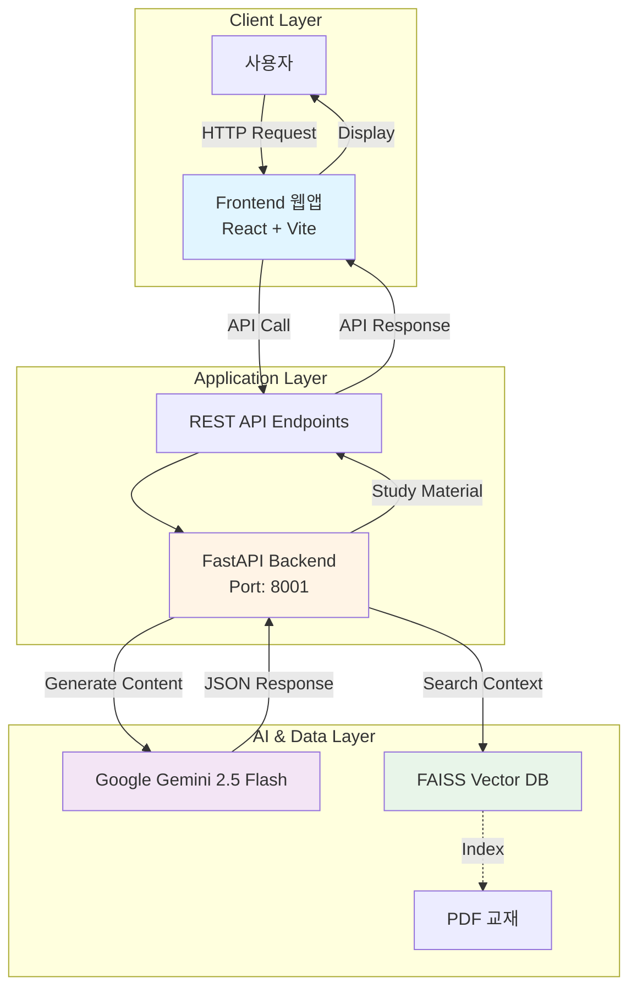
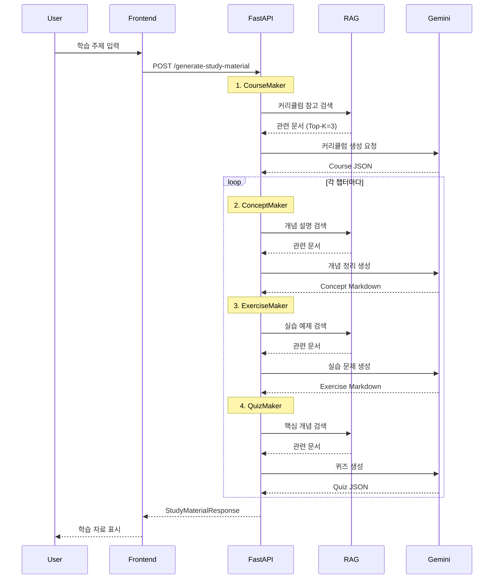
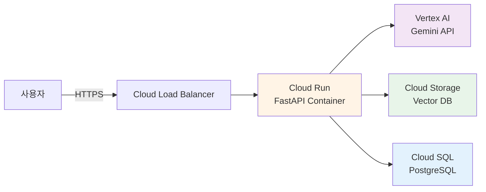

# PopPins II - 시스템 아키텍처 문서

**프로젝트**: PopPins II (어딧세이 가제)  
**문서 타입**: Architecture Diagram & System Design  
**버전**: 1.4.2  
**작성일**: 2025-11-22  
**최종 업데이트**: 2025-11-22  
**작성자**: 이진걸

---

## 📌 개요

PopPins II는 AI 기반 PBL(Problem-Based Learning) 학습 자료 자동 생성 플랫폼으로, **FastAPI Backend**, **Google Gemini AI**, **FAISS Vector DB**를 핵심으로 하는 3-Layer Architecture입니다.

---

## 🏗️ 전체 시스템 아키텍처

### High-Level Architecture



---

## 🔧 Component Architecture

### 1. Frontend Layer (✅ 완료)

**기술 스택**:
- React 19 + TypeScript
- Vite (빌드 도구)
- TailwindCSS (스타일링)
- Axios (HTTP 클라이언트)
- React Router (라우팅)
- React Markdown (마크다운 렌더링)

**주요 컴포넌트**:
```
src/
├── pages/
│   ├── HomePage.tsx           # 주제 입력 폼
│   ├── ResultPage.tsx         # 커리큘럼 표시
│   └── ChapterPage.tsx        # 챕터 상세 (개념, 실습, 퀴즈)
├── components/
│   └── MarkdownViewer.tsx     # 마크다운 렌더링 (코드 블록 커스텀)
├── services/
│   └── api.ts                 # API 호출 함수
└── App.tsx                    # 메인 앱
```

**주요 기능**:
- ✅ Lazy-Loading 커리큘럼 (빠른 초기 로드)
- ✅ 챕터별 상세 콘텐츠 로드
- ✅ 퀴즈 AI 채점 기능
- ✅ 챕터 다운로드 (Markdown)
- ✅ 반응형 UI/UX

**상태**: ✅ 완료

---

### 2. Backend Layer (✅ 완료)

**기술 스택**:
- FastAPI 0.104.0+
- Python 3.8+
- Uvicorn (ASGI 서버)
- Pydantic (데이터 검증)

**디렉토리 구조**:
```
app/
├── main_with_RAG.py          # 메인 애플리케이션
├── .env                       # 환경 변수
├── requirements.txt           # 의존성
└── vector_db/                 # FAISS 벡터 DB
    └── python_textbook_gemini_db/
```

**API 엔드포인트**:

| Method | Endpoint | 설명 | 상태 |
|--------|----------|------|------|
| POST | `/generate-course` | 커리큘럼만 생성 (Lazy-Loading) | ✅ |
| POST | `/generate-chapter-content` | 챕터 상세 내용 생성 | ✅ |
| POST | `/generate-study-material` | 학습 자료 일괄 생성 (하위 호환) | ✅ |
| POST | `/download-chapter` | 챕터 Markdown 다운로드 | ✅ |
| POST | `/grade-quiz` | 퀴즈 AI 채점 | ✅ |
| GET | `/` | API 정보 | ✅ |
| GET | `/health` | 서버 상태 확인 | ✅ |

**핵심 함수**:
- `initialize_rag_vector_db()`: FAISS 벡터 DB 초기화
- `search_rag_context()`: RAG 컨텍스트 검색
- `generate_course()`: 커리큘럼 생성
- `generate_concept()`: 개념 정리 생성
- `generate_exercise()`: 실습 과제 생성
- `generate_quiz()`: 퀴즈 생성

---

### 3. AI Engine Layer (✅ 완료)

#### Google Gemini 2.5 Flash

**설정**:
```python
model = genai.GenerativeModel(
    model_name="gemini-2.5-flash",
    generation_config={
        "temperature": 0.7,
        "max_output_tokens": 8192,
    }
)
```

**역할별 프롬프트**:
- **CourseMaker**: 커리큘럼 설계 전문가
- **ConceptMaker**: 개념 정리 전문가 (1000~1200자, Markdown)
- **ExerciseMaker**: 실습 문제 출제자 (3개 문제)
- **QuizMaker**: 평가 문제 출제자 (3개 주관식)

**응답 형식**: JSON

---

### 4. Vector DB Layer (✅ 완료)

#### FAISS (Facebook AI Similarity Search)

**구성**:
```python
embeddings = GoogleGenerativeAIEmbeddings(
    model="models/text-embedding-004"
)
vector_store = FAISS.load_local(
    VECTOR_DB_PATH, 
    embeddings,
    allow_dangerous_deserialization=True
)
```

**문서 처리 파이프라인**:
```
PDF 파일
    ↓
PyPDFLoader (텍스트 추출)
    ↓
RecursiveCharacterTextSplitter
 - chunk_size: 1000
 - chunk_overlap: 200
    ↓
GoogleGenerativeAIEmbeddings
 - model: text-embedding-004
 - dimension: 768
    ↓
FAISS VectorStore 저장
    ↓
Similarity Search (Top-K=3)
```

**메타데이터**:
- `file_name`: 파일명
- `source_file`: 파일 경로
- `page`: 페이지 번호

---

## 📊 Data Flow Architecture

### Request Processing Flow



---

## 🗄️ Database Architecture (⏳ 계획)

### ERD 기반 설계

향후 PostgreSQL 도입 시 사용할 테이블:

```
Member (사용자)
    ↓ 1:N
Course (강좌)
    ↓ 1:N
Chapter (챕터)
    ↓ 1:N
├── Concept (개념)
├── Exercise (실습)
└── Quiz (퀴즈)
    ↓ 1:N
Result (학습 결과)
```

**상태**: ⏳ MVP 이후 구현 예정

---

## 🔐 Security Architecture

### 현재 보안 구성 (✅)

1. **API Key 관리**:
   ```env
   GEMINI_API_KEY=your-api-key  # .env 파일
   ```

2. **환경 변수 분리**:
   - `.env` 파일 사용
   - `.gitignore`에 추가

3. **입력 검증**:
   - Pydantic 모델로 타입 검증
   - HTTPException 에러 처리

### 향후 보안 강화 (⏳)

- JWT 토큰 기반 인증
- CORS 정책 세분화
- Rate Limiting
- API Key 로테이션

---

## 🚀 Deployment Architecture (⏳ 계획)

### GCP 기반 배포 아키텍처



**주요 서비스**:
- **Cloud Run**: 컨테이너 배포 (FastAPI)
- **Vertex AI**: Gemini API 호스팅
- **Cloud Storage**: FAISS 벡터 DB 저장
- **Cloud SQL**: PostgreSQL 관리형 DB

**상태**: ⏳ 향후 계획

---

## 📈 Scalability Considerations

### 수평 확장 전략

1. **Backend Scaling**:
   - Cloud Run 자동 스케일링
   - Stateless 설계

2. **Vector DB Scaling**:
   - FAISS → Pinecone/Weaviate 마이그레이션 검토
   - 분산 벡터 검색

3. **Caching Strategy**:
   - Redis 캐시 도입
   - 동일 주제 재생성 방지

---

## 🔍 Monitoring & Logging (⏳)

### 계획된 모니터링 구성

- **Application Monitoring**: Cloud Monitoring
- **Error Tracking**: Sentry
- **API Logging**: FastAPI 로그 → Cloud Logging
- **Performance Metrics**: 응답 시간, 처리량

---

## 📚 Technology Stack Summary

| Layer | Technology | Version | Status |
|-------|-----------|---------|--------|
| Frontend | React + TypeScript + Vite | 19 | ✅ 완료 |
| Backend | FastAPI | 0.104+ | ✅ 완료 |
| AI | Google Gemini | 2.5 Flash | ✅ 완료 |
| Embedding | text-embedding-004 | - | ✅ 완료 |
| Vector DB | FAISS (Gemini) | python_textbook_gemini_db | ✅ 완료 |
| Database | In-Memory Cache | - | ✅ 완료 |
| Deployment | Local Development | - | ✅ 완료 |

---

## 🎯 Architecture Principles

1. **단순성 우선**: MVP는 최소 구성 요소로 시작
2. **모듈화**: 각 AI 생성기 독립적 설계
3. **확장성**: 컴포넌트 추가/변경 용이
4. **신뢰성**: RAG로 PDF 기반 정확성 확보
5. **성능**: 챕터당 10-30초 생성 목표

---

**문서 버전**: 1.4.2  
**최종 수정일**: 2025-11-22  
**상태**: 현재 아키텍처 문서화 완료  
**다음 단계**: Frontend 개발, DB 통합
