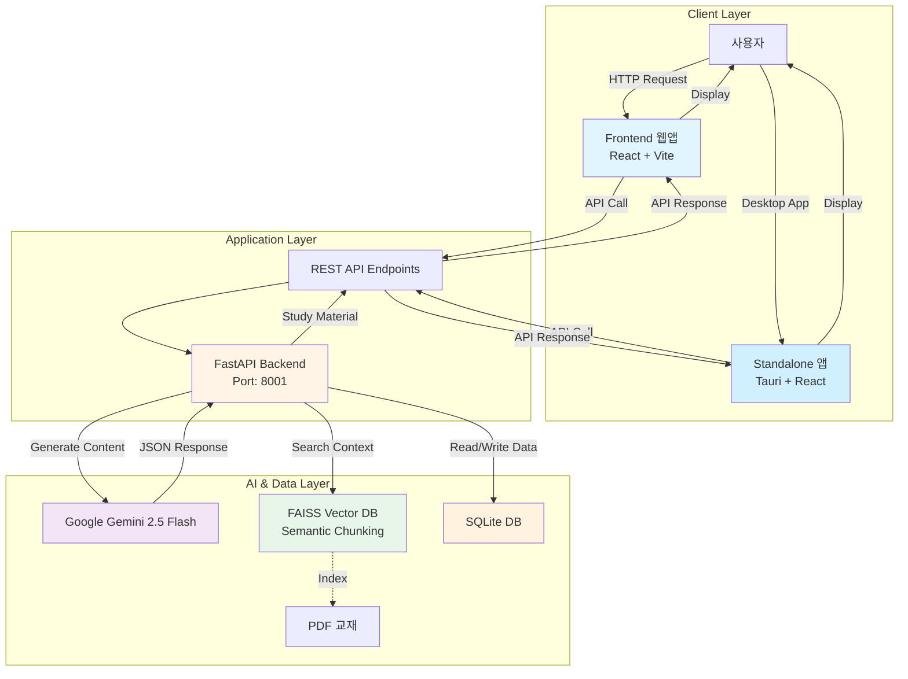
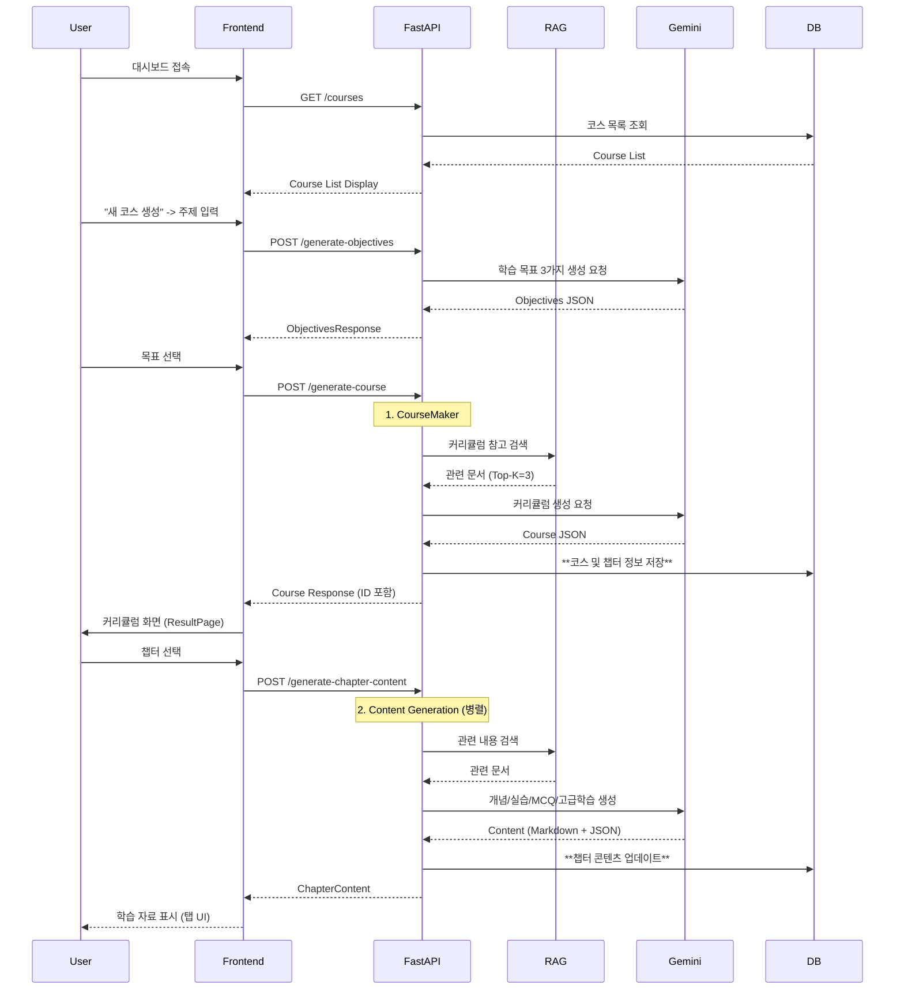
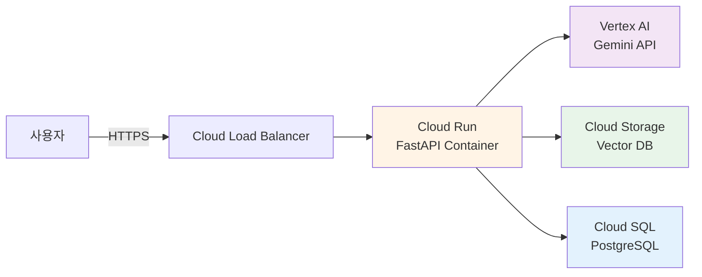

# PopPins II - 시스템 아키텍처 문서

**프로젝트**: PopPins II (어딧세이 가제)  
**문서 타입**: Architecture Diagram & System Design  
**버전**: 2.1.0  
**작성일**: 2025-11-22  
**작성자**: 이진걸  
**최종 업데이트**: 2025-11-28

---

## 📌 개요

PopPins II는 AI 기반 PBL(Problem-Based Learning) 학습 자료 자동 생성 플랫폼으로, **FastAPI Backend**, **Google Gemini AI**, **FAISS Vector DB**를 핵심으로 하는 3-Layer Architecture입니다. v2.1.0에서는 **SQLite 기반 영구 저장소(Persistence)**, **대시보드(Dashboard)**, **객관식 퀴즈(MCQ)**, **고급 학습 섹션**, 그리고 **Tauri 기반 Standalone 데스크탑 앱**이 추가되었습니다.

---

## 🏗️ 전체 시스템 아키텍처

### High-Level Architecture



---

## 🔧 Component Architecture

### 1. Frontend Layer (✅ 완료)

**기술 스택**:
- React 19 + TypeScript
- Vite (빌드 도구)
- TailwindCSS (스타일링)
- Axios (HTTP 클라이언트)
- React Router (라우팅)
- React Markdown (마크다운 렌더링)

**주요 컴포넌트**:
```
src/
├── pages/
│   ├── DashboardPage.tsx      # (New) 메인 대시보드 (최근 학습 목록)
│   ├── NewCoursePage.tsx      # (Renamed) 주제 입력 및 코스 생성
│   ├── ObjectivesPage.tsx     # 학습 목표 선택
│   ├── ResultPage.tsx         # 커리큘럼 표시 (DB 연동)
│   └── ChapterPage.tsx        # 챕터 상세 (개념, 실습, 퀴즈, 피드백)
├── components/
│   └── MarkdownViewer.tsx     # 마크다운 렌더링 (코드 블록 커스텀)
├── services/
│   └── api.ts                 # API 호출 함수
└── App.tsx                    # 메인 앱 및 라우팅
```

**주요 기능**:
- ✅ **대시보드**: 최근 학습한 코스 목록 조회 및 이어하기
- ✅ **영구 저장**: 새로고침 후에도 학습 데이터 유지
- ✅ Lazy-Loading 커리큘럼 (빠른 초기 로드)
- ✅ 학습 목표 선택 (기초/실무/심화)
- ✅ 챕터별 상세 콘텐츠 로드 (개념, 실습, 퀴즈, 고급 학습)
- ✅ **객관식 퀴즈 (MCQ)**: 5개의 4지 선다형 문제와 즉각적인 피드백
- ✅ **고급 학습**: 3개의 주관식 문제와 AI 채점 기능
- ✅ 챕터 다운로드 (Markdown)
- ✅ 피드백 제출 및 반영
- ✅ 반응형 UI/UX

**상태**: ✅ 완료

---

### 2. Backend Layer (✅ 완료)

**기술 스택**:
- FastAPI 0.104.0+
- Python 3.8+
- Uvicorn (ASGI 서버)
- Pydantic (데이터 검증)
- SQLAlchemy (DB ORM)

**디렉토리 구조**:
```
pop_pins_2/
├── app/                       # 백엔드 애플리케이션
│   ├── main.py               # 메인 애플리케이션 (RAG 통합)
│   ├── main(no RAG).py       # RAG 없는 레거시 버전
│   ├── database.py           # DB 연결 설정
│   ├── models.py             # DB 모델 (Course, Chapter, GenerationLog, QuizResult, UserFeedback, UserPreference)
│   ├── services/
│   │   ├── generator.py      # AI 생성 로직 (Retry Logic, JSON Repair)
│   │   └── scorm_service.py  # SCORM 패키지 생성 (v1.10.0)
│   ├── .env                  # 환경 변수
│   └── requirements.txt      # Python 의존성 (제거됨, 루트로 통합)
├── frontend/                  # 프론트엔드 애플리케이션
│   └── src/
│       ├── pages/            # React 페이지 컴포넌트
│       ├── components/       # 재사용 컴포넌트
│       └── services/         # API 클라이언트
├── standalone/                # [NEW] Tauri 데스크탑 앱
│   ├── app/                  # 백엔드 (복사본)
│   ├── frontend/             # Tauri + React
│   ├── vector_db/            # 벡터 DB (복사본)
│   ├── launcher.py           # Python 기반 실행 스크립트
│   ├── setup.py              # 자동 구성 스크립트
│   ├── README.md             # Standalone 가이드
│   ├── QUICKSTART.md         # 빠른 시작 가이드
│   ├── ARCHITECTURE.md       # 아키텍처 상세 설명
│   ├── DEPLOYMENT.md         # 빌드 및 배포 가이드
│   └── DIFFERENCES.md        # Web vs Standalone 비교
├── tests/                     # 테스트 파일 (v1.10.0 정리)
│   ├── test_*.py             # 단위 및 통합 테스트
│   └── conftest.py           # Pytest 설정
├── scripts/                   # 유틸리티 스크립트 (v1.10.0 정리)
│   ├── rag/                  # RAG/Vector DB 도구
│   ├── db/                   # 데이터베이스 관리 도구
│   └── qa/                   # QA 및 개발 도구
├── python_textbook_gemini_db_semantic/  # FAISS 벡터 DB (Semantic Chunking)
├── requirements.txt           # Python 의존성 (통합됨)
└── .gitignore                # Git 무시 파일
```

**API 엔드포인트**:

| Method | Endpoint | 설명 | 상태 |
|--------|----------|------|------|
| GET | `/courses` | (New) 생성된 코스 목록 조회 | ✅ |
| GET | `/courses/{id}` | (New) 특정 코스 상세 조회 | ✅ |
| POST | `/generate-objectives` | 학습 목표 3가지 제안 | ✅ |
| POST | `/generate-course` | 커리큘럼 생성 및 DB 저장 | ✅ |
| POST | `/generate-chapter-content` | 챕터 상세 내용 생성 (개념, 실습, MCQ, 고급학습) | ✅ |
| POST | `/generate-study-material` | 학습 자료 일괄 생성 (하위 호환) | ✅ |
| POST | `/download-chapter` | 챕터 Markdown 다운로드 | ✅ |
| POST | `/grade-quiz` | 주관식 퀴즈 AI 채점 | ✅ |
| GET | `/quiz-results` | 퀴즈 채점 결과 목록 조회 | ✅ |
| POST | `/feedback` | 사용자 피드백 저장 | ✅ |
| GET | `/history` | 생성 이력 조회 | ✅ |
| GET | `/` | API 정보 | ✅ |
| GET | `/health` | 서버 상태 확인 | ✅ |

**핵심 함수**:
- `initialize_rag_vector_db()`: FAISS 벡터 DB 초기화 (Semantic Chunking)
- `search_rag_context()`: RAG 컨텍스트 검색
- `generate_learning_objectives()`: 학습 목표 생성 (Retry Logic)
- `generate_course()`: 커리큘럼 생성 및 DB 저장
- `generate_concept()`: 개념 정리 생성
- `generate_exercise()`: 실습 과제 생성
- `generate_quiz()`: 객관식 퀴즈 5개 생성 (MCQ)
- `generate_advanced_learning()`: 주관식 문제 3개 생성

---

### 3. AI Engine Layer (✅ 완료)

#### Google Gemini 2.5 Flash

**설정**:
```python
model = genai.GenerativeModel(
    model_name="gemini-2.5-flash",
    generation_config={
        "temperature": 0.7,
        "max_output_tokens": 8192,
    }
)
```

**역할별 프롬프트**:
- **ObjectivesMaker**: 학습 경로 설계자 (3가지 경로)
- **CourseMaker**: 커리큘럼 설계 전문가
- **ConceptMaker**: 개념 정리 전문가 (1000~1200자, Markdown)
- **ExerciseMaker**: 실습 문제 출제자 (3개 문제)
- **QuizMaker**: 객관식 평가 문제 출제자 (5개 4지선다형)
- **AdvancedLearningMaker**: 주관식 심화 문제 출제자 (3개 서술형)

**응답 형식**: JSON

---

### 4. Vector DB Layer (✅ 완료)

#### FAISS (Facebook AI Similarity Search)

**구성**:
```python
embeddings = GoogleGenerativeAIEmbeddings(
    model="models/text-embedding-004"
)
vector_store = FAISS.load_local(
    VECTOR_DB_PATH, 
    embeddings,
    allow_dangerous_deserialization=True
)
```

**문서 처리 파이프라인**:
```
PDF 파일
    ↓
PyPDFLoader (텍스트 추출)
    ↓
Page Filtering & Cleaning
 - TOC, Index, Cover pages 제거
 - 불필요한 공백 제거
    ↓
SemanticChunker (의미 기반 분할)
 - embedding 모델로 의미적 경계 파악
 - 문맥 보존 향상
    ↓
Metadata Enhancement
 - Section 헤더 자동 추출
 - 페이지 및 파일 정보
    ↓
GoogleGenerativeAIEmbeddings
 - model: text-embedding-004
 - dimension: 768
    ↓
FAISS VectorStore 저장
    ↓
Similarity Search (Top-K=3)
```

**메타데이터**:
- `file_name`: 파일명
- `source_file`: 파일 경로
- `page`: 페이지 번호
- `section`: 섹션 헤더 (자동 추출)

---

## 📊 Data Flow Architecture

### Request Processing Flow



---

## 🗄️ Database Architecture (✅ 완료)

### SQLite Schema

**Course**:
- `id`: PK
- `topic`: 주제
- `description`: 설명
- `level`: 난이도
- `created_at`: 생성 시간

**Chapter**:
- `id`: PK
- `course_id`: FK (Course.id)
- `title`: 챕터 제목
- `description`: 챕터 설명
- `content`: 본문 내용 (JSON: concept, exercise, quiz, advanced_learning)
- `is_completed`: 완료 여부

**GenerationLog**:
- `id`: PK
- `request_type`: "objectives", "course", "concept", etc.
- `topic`: 주제
- `prompt_context`: 프롬프트 내용
- `generated_content`: 생성된 JSON
- `model_name`: 사용된 AI 모델
- `latency_ms`: 생성 소요 시간 (밀리초)
- `timestamp`: 생성 시간

**QuizResult**:
- `id`: PK
- `chapter_title`: 챕터명
- `score`: 점수 (0-100)
- `weak_points`: 취약점 분석 (JSON)
- `correct_points`: 잘한 점 (JSON)
- `feedback`: 전체 피드백
- `user_answer`: 사용자 제출 답안
- `timestamp`: 채점 시간

**UserFeedback**:
- `id`: PK
- `chapter_title`: 챕터명
- `rating`: 별점 (1-5)
- `comment`: 코멘트
- `timestamp`: 제출 시간

**UserPreference**:
- `id`: PK
- `learning_goal`: 학습 목표
- `learning_style`: 학습 스타일
- `desired_depth`: 원하는 학습 깊이
- `created_at`: 저장 시간

**상태**: ✅ Dashboard & Persistence 구현 완료

---

## 🔐 Security Architecture

### 현재 보안 구성 (✅)

1. **API Key 관리**:
   ```env
   GEMINI_API_KEY=your-api-key  # .env 파일
   ```

2. **환경 변수 분리**:
   - `.env` 파일 사용
   - `.gitignore`에 추가

3. **입력 검증**:
   - Pydantic 모델로 타입 검증
   - HTTPException 에러 처리

### 향후 보안 강화 (⏳)

- JWT 토큰 기반 인증
- CORS 정책 세분화
- Rate Limiting
- API Key 로테이션

---

## 🚀 Deployment Architecture (⏳ 계획)

### GCP 기반 배포 아키텍처



**주요 서비스**:
- **Cloud Run**: 컨테이너 배포 (FastAPI)
- **Vertex AI**: Gemini API 호스팅
- **Cloud Storage**: FAISS 벡터 DB 저장
- **Cloud SQL**: PostgreSQL 관리형 DB

**상태**: ⏳ 향후 계획

---

## 📈 Scalability Considerations

### 수평 확장 전략

1. **Backend Scaling**:
   - Cloud Run 자동 스케일링
   - Stateless 설계

2. **Vector DB Scaling**:
   - FAISS → Pinecone/Weaviate 마이그레이션 검토
   - 분산 벡터 검색

3. **Caching Strategy**:
   - Redis 캐시 도입
   - 동일 주제 재생성 방지

---

## 🔍 Monitoring & Logging (✅)

### 구현된 모니터링 구성

- **Application Monitoring**: Cloud Monitoring
- **Error Tracking**: Sentry
- **API Logging**: FastAPI 로그 → Cloud Logging
- **Performance Metrics**: 응답 시간, 처리량

---

## 📚 Technology Stack Summary

| Layer | Technology | Version | Status |
|-------|-----------|---------|--------|
| Frontend | React + TypeScript + Vite | 19 | ✅ 완료 |
| Standalone | Tauri + React | 2.x | ✅ 완료 |
| Backend | FastAPI | 0.104+ | ✅ 완료 |
| AI | Google Gemini | 2.5 Flash | ✅ 완료 |
| Embedding | text-embedding-004 | - | ✅ 완료 |
| Vector DB | FAISS (Gemini) | python_textbook_gemini_db_semantic | ✅ 완료 |
| Chunking | SemanticChunker | LangChain Experimental | ✅ 완료 |
| Database | SQLite (Persistence) | - | ✅ 완료 |
| Deployment | Local Development | - | ✅ 완료 |

---

## 🎯 Architecture Principles

1. **단순성 우선**: MVP는 최소 구성 요소로 시작
2. **모듈화**: 각 AI 생성기 독립적 설계
3. **확장성**: 컴포넌트 추가/변경 용이
4. **신뢰성**: RAG로 PDF 기반 정확성 확보
5. **성능**: 챕터당 10-30초 생성 목표

---

**문서 버전**: 2.1.0  
**최종 수정일**: 2025-11-28  
**상태**: 현재 아키텍처 문서화 완료 (Backend + Frontend + DB + Persistence + Standalone App)  
**다음 단계**: 배포 파이프라인 구축, 모바일 앱 개발 검토

