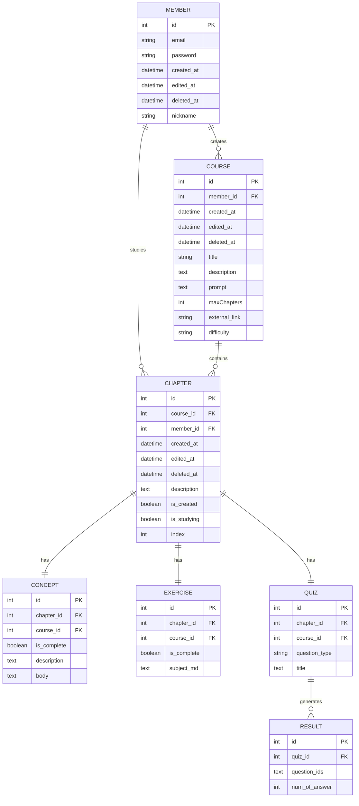

# PopPins II - ERD (Entity Relationship Diagram)

**프로젝트**: PopPins II (어딧세이 가제)  
**문서 타입**: Database Schema & ERD  
**버전**: 1.4.2  
**작성일**: 2025-11-22  
**최종 업데이트**: 2025-11-22  
**작성자**: 이진걸

---

## 📌 개요

PopPins II의 데이터베이스 스키마 설계 문서입니다. 현재 MVP는 DB를 사용하지 않지만, 향후 **사용자 인증**, **학습 히스토리**, **진도 관리** 기능 추가 시 활용할 PostgreSQL 스키마입니다.

**기반**: `extra_references/POP.PINS.sql` 파일 참고

---

## 🗄️ ERD Diagram

### Entity Relationship Overview



---

## 📋 Table Specifications

### 1. Member (회원)

**설명**: 사용자 계정 정보

| Column | Type | Null | Key | Description |
|--------|------|------|-----|-------------|
| id | INT | NOT NULL | PK | 사용자 ID (자동 증가) |
| email | VARCHAR(255) | NOT NULL | UNIQUE | 이메일 (로그인 ID) |
| password | VARCHAR(255) | NULL | | 비밀번호 (해시) |
| created_at | DATETIME | NOT NULL | | 가입 일시 |
| edited_at | DATETIME | NULL | | 수정 일시 |
| deleted_at | DATETIME | NULL | | 탈퇴 일시 (Soft Delete) |
| nickname | VARCHAR(100) | NULL | | 닉네임 |

**인덱스**:
- PRIMARY KEY (id)
- UNIQUE INDEX (email)

**관계**:
- Course (1:N) - 한 사용자가 여러 강좌 생성
- Chapter (1:N) - 한 사용자가 여러 챕터 학습

---

### 2. Course (강좌)

**설명**: 학습 강좌 정보 (커리큘럼)

| Column | Type | Null | Key | Description |
|--------|------|------|-----|-------------|
| id | INT | NOT NULL | PK | 강좌 ID (자동 증가) |
| member_id | INT | NOT NULL | FK | 생성자 ID |
| created_at | DATETIME | NOT NULL | | 생성 일시 |
| edited_at | DATETIME | NULL | | 수정 일시 |
| deleted_at | DATETIME | NULL | | 삭제 일시 (Soft Delete) |
| title | VARCHAR(255) | NOT NULL | | 강좌 제목 |
| description | TEXT | NOT NULL | | 강좌 설명 |
| prompt | TEXT | NOT NULL | | 사용자 입력 프롬프트 |
| maxChapters | INT | NOT NULL | | 최대 챕터 수 (기본값: 3) |
| external_link | VARCHAR(500) | NULL | | 외부 링크 (선택) |
| difficulty | VARCHAR(50) | NOT NULL | | 난이도 (초급/중급/고급) |

**인덱스**:
- PRIMARY KEY (id)
- FOREIGN KEY (member_id) REFERENCES Member(id)
- INDEX (member_id, created_at)

**관계**:
- Member (N:1) - 생성자
- Chapter (1:N) - 강좌 내 챕터들

---

### 3. Chapter (챕터)

**설명**: 강좌 내 각 챕터 정보

| Column | Type | Null | Key | Description |
|--------|------|------|-----|-------------|
| id | INT | NOT NULL | PK | 챕터 ID (자동 증가) |
| course_id | INT | NOT NULL | FK | 소속 강좌 ID |
| member_id | INT | NOT NULL | FK | 학습자 ID |
| created_at | DATETIME | NOT NULL | | 생성 일시 |
| edited_at | DATETIME | NULL | | 수정 일시 |
| deleted_at | DATETIME | NULL | | 삭제 일시 (Soft Delete) |
| description | TEXT | NULL | | 챕터 설명 |
| is_created | BOOLEAN | NOT NULL | | 생성 완료 여부 (기본값: FALSE) |
| is_studying | BOOLEAN | NOT NULL | | 학습 중 여부 (기본값: FALSE) |
| index | INT | NOT NULL | | 챕터 순서 (1, 2, 3, ...) |

**인덱스**:
- PRIMARY KEY (id)
- FOREIGN KEY (course_id) REFERENCES Course(id)
- FOREIGN KEY (member_id) REFERENCES Member(id)
- INDEX (course_id, index)

**관계**:
- Course (N:1) - 소속 강좌
- Member (N:1) - 학습자
- Concept (1:1) - 개념 정리
- Exercise (1:1) - 실습 과제
- Quiz (1:1) - 퀴즈

---

### 4. Concept (개념 정리)

**설명**: 각 챕터의 개념 정리 내용

| Column | Type | Null | Key | Description |
|--------|------|------|-----|-------------|
| id | INT | NOT NULL | PK | 개념 ID (자동 증가) |
| chapter_id | INT | NOT NULL | FK | 소속 챕터 ID |
| course_id | INT | NOT NULL | FK | 소속 강좌 ID |
| is_complete | BOOLEAN | NOT NULL | | 학습 완료 여부 (기본값: FALSE) |
| description | TEXT | NULL | | 개념 요약 |
| body | TEXT | NOT NULL | | 개념 본문 (Markdown) |

**인덱스**:
- PRIMARY KEY (id)
- FOREIGN KEY (chapter_id) REFERENCES Chapter(id)
- FOREIGN KEY (course_id) REFERENCES Course(id)
- UNIQUE INDEX (chapter_id)

**관계**:
- Chapter (1:1) - 소속 챕터

---

### 5. Exercise (실습 과제)

**설명**: 각 챕터의 실습 문제

| Column | Type | Null | Key | Description |
|--------|------|------|-----|-------------|
| id | INT | NOT NULL | PK | 실습 ID (자동 증가) |
| chapter_id | INT | NOT NULL | FK | 소속 챕터 ID |
| course_id | INT | NOT NULL | FK | 소속 강좌 ID |
| is_complete | BOOLEAN | NOT NULL | | 완료 여부 (기본값: FALSE) |
| subject_md | TEXT | NOT NULL | | 실습 문제 (Markdown) |

**인덱스**:
- PRIMARY KEY (id)
- FOREIGN KEY (chapter_id) REFERENCES Chapter(id)
- FOREIGN KEY (course_id) REFERENCES Course(id)
- UNIQUE INDEX (chapter_id)

**관계**:
- Chapter (1:1) - 소속 챕터

---

### 6. Quiz (퀴즈)

**설명**: 각 챕터의 평가 퀴즈

| Column | Type | Null | Key | Description |
|--------|------|------|-----|-------------|
| id | INT | NOT NULL | PK | 퀴즈 ID (자동 증가) |
| chapter_id | INT | NOT NULL | FK | 소속 챕터 ID |
| course_id | INT | NOT NULL | FK | 소속 강좌 ID |
| question_type | VARCHAR(50) | NULL | | 문제 유형 (주관식/객관식) |
| title | TEXT | NOT NULL | | 퀴즈 제목/문제 |

**인덱스**:
- PRIMARY KEY (id)
- FOREIGN KEY (chapter_id) REFERENCES Chapter(id)
- FOREIGN KEY (course_id) REFERENCES Course(id)
- INDEX (chapter_id)

**관계**:
- Chapter (1:N) - 소속 챕터
- Result (1:N) - 퀴즈 결과

---

### 7. Result (학습 결과)

**설명**: 퀴즈 응답 결과

| Column | Type | Null | Key | Description |
|--------|------|------|-----|-------------|
| id | INT | NOT NULL | PK | 결과 ID (자동 증가) |
| quiz_id | INT | NOT NULL | FK | 퀴즈 ID |
| question_ids | TEXT | NULL | | 문제 ID 목록 (JSON) |
| num_of_answer | INT | NULL | | 정답 개수 |

**인덱스**:
- PRIMARY KEY (id)
- FOREIGN KEY (quiz_id) REFERENCES Quiz(id)
- INDEX (quiz_id)

**관계**:
- Quiz (N:1) - 소속 퀴즈

---

## 🔗 Relationship Summary

### One-to-Many (1:N)

| Parent | Child | Description |
|--------|-------|-------------|
| Member | Course | 한 사용자가 여러 강좌 생성 |
| Member | Chapter | 한 사용자가 여러 챕터 학습 |
| Course | Chapter | 한 강좌에 여러 챕터 |
| Quiz | Result | 한 퀴즈에 여러 결과 |

### One-to-One (1:1)

| Entity A | Entity B | Description |
|----------|----------|-------------|
| Chapter | Concept | 챕터당 1개 개념 정리 |
| Chapter | Exercise | 챕터당 1개 실습 |

### One-to-Many (실제는 N:M 가능)

| Parent | Child | Description |
|--------|-------|-------------|
| Chapter | Quiz | 챕터당 여러 퀴즈 (3개 기준) |

---

## 🔧 Implementation Considerations

### 1. Soft Delete 패턴

모든 주요 테이블에 `deleted_at` 컬럼 사용:
- NULL: 활성 상태
- NOT NULL: 삭제된 상태

**장점**:
- 데이터 복구 가능
- 학습 히스토리 보존
- 감사(Audit) 추적

### 2. 타임스탬프 관리

- `created_at`: INSERT 시 자동 설정
- `edited_at`: UPDATE 시 자동 갱신
- `deleted_at`: DELETE 시 현재 시각 설정

### 3. 트랜잭션 설계

**학습 자료 생성 트랜잭션**:
```sql
BEGIN;
  INSERT INTO Course VALUES (...);
  INSERT INTO Chapter VALUES (...);
  INSERT INTO Concept VALUES (...);
  INSERT INTO Exercise VALUES (...);
  INSERT INTO Quiz VALUES (...);
COMMIT;
```

### 4. 인덱스 전략

**성능 최적화**:
- `course_id`, `chapter_id`에 Foreign Key 인덱스
- `member_id + created_at` 복합 인덱스 (최근 학습 조회)
- `is_complete` 플래그 인덱스 (진도율 계산)

---

## 📊 Data Volume Estimation

### MVP 기준 (50명 사용자)

| Table | Rows per User | Total Rows | Storage |
|-------|---------------|------------|---------|
| Member | 1 | 50 | ~10 KB |
| Course | 5 | 250 | ~50 KB |
| Chapter | 15 (3/course) | 750 | ~150 KB |
| Concept | 15 | 750 | ~500 KB |
| Exercise | 15 | 750 | ~300 KB |
| Quiz | 45 (3/chapter) | 2,250 | ~200 KB |
| Result | 45 | 2,250 | ~50 KB |

**Total**: ~1.3 MB (텍스트 데이터 기준)

---

## 🔐 Data Security

### 1. 민감 정보 처리

- **Password**: bcrypt 해싱 (cost=12)
- **Email**: SSL/TLS 전송

### 2. 접근 제어

```sql
-- 사용자는 본인의 데이터만 조회
SELECT * FROM Course 
WHERE member_id = :current_user_id;
```

### 3. SQL Injection 방지

- Parameterized Query 사용 (SQLAlchemy ORM)
- ORM 레벨에서 입력 검증

---

## 🚀 Migration Strategy

### Phase 1: 초기 스키마 생성 (⏳)

```bash
# Alembic 마이그레이션 도구 사용
alembic init migrations
alembic revision --autogenerate -m "Initial schema"
alembic upgrade head
```

### Phase 2: 데이터 마이그레이션 (⏳)

1. 현재 JSON 응답 → DB 저장 로직 추가
2. 기존 사용자 데이터 임포트 (없음)
3. 테스트 데이터 시딩

### Phase 3: API 통합 (⏳)

```python
# SQLAlchemy 모델 추가
class Course(Base):
    __tablename__ = "course"
    id = Column(Integer, primary_key=True)
    member_id = Column(Integer, ForeignKey("member.id"))
    title = Column(String(255), nullable=False)
    # ...
```

---

## 📝 SQL Schema (PostgreSQL)

### 개선된 스키마 (타입 명시)

```sql
-- Member Table
CREATE TABLE member (
    id SERIAL PRIMARY KEY,
    email VARCHAR(255) NOT NULL UNIQUE,
    password VARCHAR(255),
    created_at TIMESTAMP NOT NULL DEFAULT CURRENT_TIMESTAMP,
    edited_at TIMESTAMP,
    deleted_at TIMESTAMP,
    nickname VARCHAR(100)
);

-- Course Table
CREATE TABLE course (
    id SERIAL PRIMARY KEY,
    member_id INTEGER NOT NULL REFERENCES member(id) ON DELETE CASCADE,
    created_at TIMESTAMP NOT NULL DEFAULT CURRENT_TIMESTAMP,
    edited_at TIMESTAMP,
    deleted_at TIMESTAMP,
    title VARCHAR(255) NOT NULL,
    description TEXT NOT NULL,
    prompt TEXT NOT NULL,
    max_chapters INTEGER NOT NULL DEFAULT 3,
    external_link VARCHAR(500),
    difficulty VARCHAR(50) NOT NULL
);

-- Chapter Table
CREATE TABLE chapter (
    id SERIAL PRIMARY KEY,
    course_id INTEGER NOT NULL REFERENCES course(id) ON DELETE CASCADE,
    member_id INTEGER NOT NULL REFERENCES member(id) ON DELETE CASCADE,
    created_at TIMESTAMP NOT NULL DEFAULT CURRENT_TIMESTAMP,
    edited_at TIMESTAMP,
    deleted_at TIMESTAMP,
    description TEXT,
    is_created BOOLEAN NOT NULL DEFAULT FALSE,
    is_studying BOOLEAN NOT NULL DEFAULT FALSE,
    index INTEGER NOT NULL
);

-- Concept Table
CREATE TABLE concept (
    id SERIAL PRIMARY KEY,
    chapter_id INTEGER NOT NULL REFERENCES chapter(id) ON DELETE CASCADE,
    course_id INTEGER NOT NULL REFERENCES course(id) ON DELETE CASCADE,
    is_complete BOOLEAN NOT NULL DEFAULT FALSE,
    description TEXT,
    body TEXT NOT NULL,
    UNIQUE(chapter_id)
);

-- Exercise Table
CREATE TABLE exercise (
    id SERIAL PRIMARY KEY,
    chapter_id INTEGER NOT NULL REFERENCES chapter(id) ON DELETE CASCADE,
    course_id INTEGER NOT NULL REFERENCES course(id) ON DELETE CASCADE,
    is_complete BOOLEAN NOT NULL DEFAULT FALSE,
    subject_md TEXT NOT NULL,
    UNIQUE(chapter_id)
);

-- Quiz Table
CREATE TABLE quiz (
    id SERIAL PRIMARY KEY,
    chapter_id INTEGER NOT NULL REFERENCES chapter(id) ON DELETE CASCADE,
    course_id INTEGER NOT NULL REFERENCES course(id) ON DELETE CASCADE,
    question_type VARCHAR(50),
    title TEXT NOT NULL
);

-- Result Table
CREATE TABLE result (
    id SERIAL PRIMARY KEY,
    quiz_id INTEGER NOT NULL REFERENCES quiz(id) ON DELETE CASCADE,
    question_ids TEXT,
    num_of_answer INTEGER
);

-- Indexes
CREATE INDEX idx_course_member ON course(member_id, created_at DESC);
CREATE INDEX idx_chapter_course ON chapter(course_id, index);
CREATE INDEX idx_chapter_studying ON chapter(is_studying) WHERE deleted_at IS NULL;
```

---

## 🎯 Next Steps

1. **SQLAlchemy 모델 작성** (⏳)
2. **Alembic 마이그레이션 설정** (⏳)
3. **API 엔드포인트 DB 통합** (⏳)
4. **테스트 데이터 시딩** (⏳)

---

**문서 버전**: 1.4.2  
**최종 수정일**: 2025-11-22  
**기반 파일**: `extra_references/POP.PINS.sql`  
**상태**: 설계 완료, 구현 대기  
**다음 마일스톤**: MVP 발표 후 DB 구축
