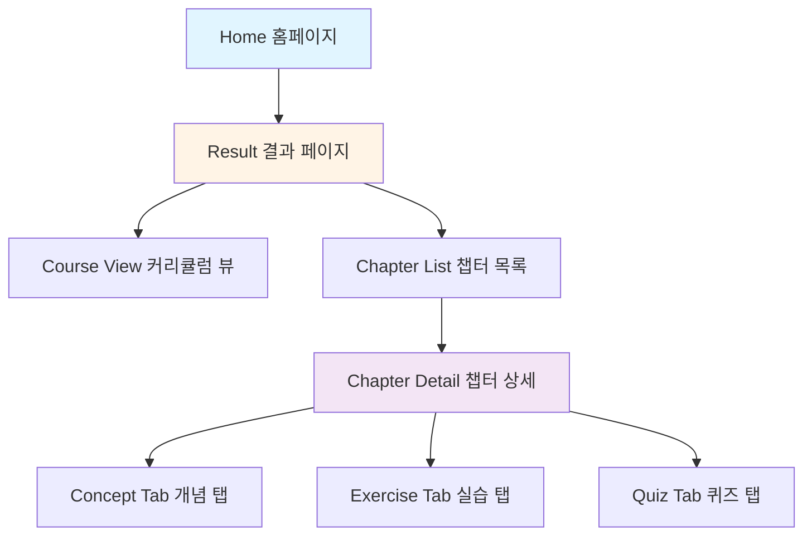
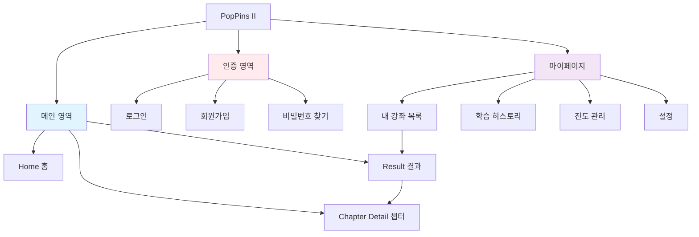
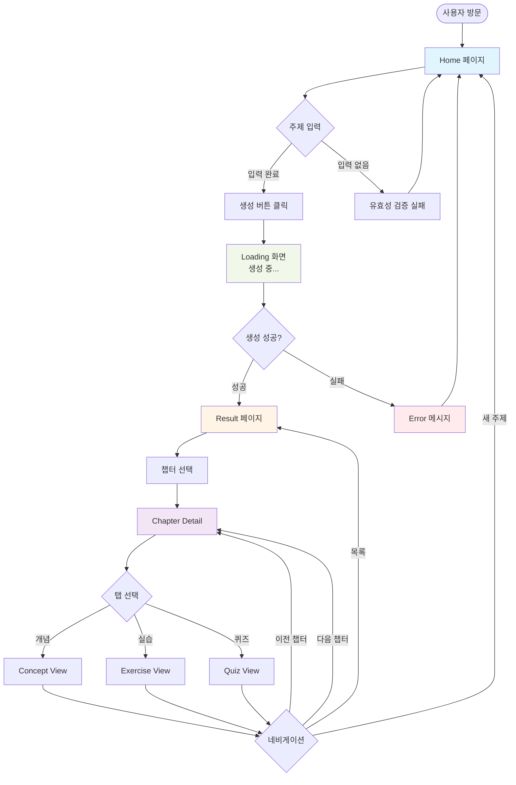
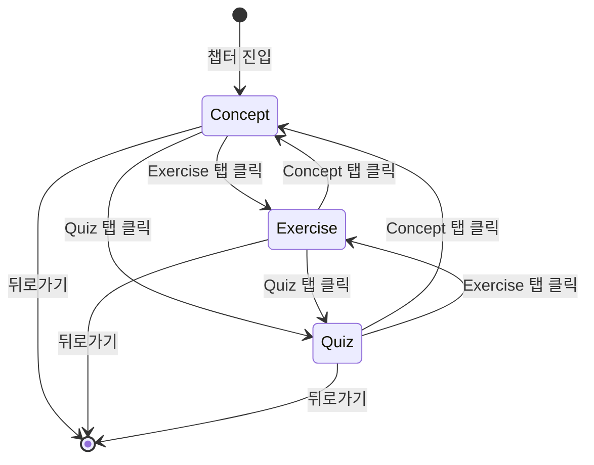

# PopPins II - IA Diagram (Information Architecture)

**프로젝트**: PopPins II (어딧세이 가제)  
**문서 타입**: Information Architecture & Navigation Flow  
**버전**: 1.9.0  
**작성일**: 2025-11-22  
**최종 업데이트**: 2025-11-26  
**작성자**: 이진걸

---

## 📌 개요

PopPins II 웹 애플리케이션의 정보 구조(IA) 및 화면 계층을 정의한 문서입니다. **화면 구성**, **네비게이션 플로우**, **정보 계층**을 Mermaid 다이어그램으로 시각화합니다.

---

## 🗺️ 1. Site Map (전체 구조)

### 1.1 MVP 화면 구조



### 1.2 확장 구조 (Post-MVP)



---

## 📱 2. Screen Hierarchy (화면 계층)

### 2.1 Level 0: Entry Point

#### Landing Page (진입 페이지)
- **URL**: `/`
- **목적**: 주제 입력 및 학습 자료 생성 시작
- **주요 요소**:
  - Hero Section (타이틀, 설명)
  - Topic Input Form
  - Quick Start CTA

---

### 2.2 Level 1: Main Pages

#### 1. Home (홈페이지)
- **URL**: `/`
- **목적**: 학습 주제 입력
- **컴포넌트**:
  ```
  Home
  ├── Header (로고, 네비게이션)
  ├── HeroSection
  │   ├── Title: "AI와 함께 설계하는 나만의 배움 여정"
  │   ├── Subtitle
  │   └── Description
  ├── TopicInputForm
  │   ├── TopicInput (텍스트 입력)
  │   ├── DifficultySelect (초급/중급/고급)
  │   ├── MaxChaptersInput (숫자 입력)
  │   └── SubmitButton ("학습 자료 생성하기")
  └── Footer
  ```

#### 2. Result (결과 페이지)
- **URL**: `/result`
- **목적**: 생성된 학습 자료 표시
- **컴포넌트**:
  ```
  Result
  ├── Header
  ├── CourseOverview
  │   ├── CourseTitle
  │   ├── CourseDescription
  │   └── Metadata (난이도, 챕터 수)
  ├── ChapterList
  │   └── ChapterCard[] (클릭 → Chapter Detail)
  │       ├── ChapterNumber
  │       ├── ChapterTitle
  │       ├── ChapterDescription
  │       ├── ProgressBadge (예정)
  │       └── ChevronIcon
  └── Footer
  ```

---

### 2.3 Level 2: Detail Pages

#### Chapter Detail (챕터 상세)
- **URL**: `/chapter/:chapterId`
- **목적**: 개념 정리, 실습, 퀴즈 표시
- **컴포넌트**:
  ```
  ChapterDetail
  ├── Header
  ├── ChapterHeader
  │   ├── ChapterTitle
  │   ├── ChapterDescription
  │   └── BackButton
  ├── TabNavigation
  │   ├── ConceptTab
  │   ├── ExerciseTab
  │   └── QuizTab
  ├── ContentArea
  │   ├── [ConceptView] (Markdown Renderer)
  │   ├── [ExerciseView] (문제 3개 + 코드 에디터)
  │   └── [QuizView] (퀴즈 3개 + 답변 입력)
  ├── NavigationButtons
  │   ├── PreviousChapterButton
  │   └── NextChapterButton
  └── Footer
  ```

---

## 🔀 3. Navigation Flow

### 3.1 User Journey Flow (MVP)



### 3.2 Tab Navigation Flow



---

## 📊 4. Information Hierarchy

### 4.1 Content Priority (콘텐츠 우선순위)

```
Level 1: 핵심 기능 (MVP)
  └─ 주제 입력 폼
  └─ 생성 결과 표시
  └─ 챕터별 콘텐츠 (개념/실습/퀴즈)

Level 2: 보조 기능 (Post-MVP)
  └─ 로그인/회원가입
  └─ 내 강좌 목록
  └─ 학습 진도 관리

Level 3: 부가 기능 (향후)
  └─ 강좌 공유
  └─ 커뮤니티
  └─ 설정/프로필
```

### 4.2 Screen Priority Matrix

| 화면 | 중요도 | 구현 우선순위 | 상태 |
|------|--------|--------------|------|
| Home (주제 입력) | 최고 | 1 | 🔄 개발 예정 |
| Loading | 높음 | 2 | 🔄 개발 예정 |
| Result (결과) | 최고 | 3 | 🔄 개발 예정 |
| Chapter Detail | 최고 | 4 | 🔄 개발 예정 |
| Login | 중간 | 5 | ⏳ 계획 |
| My Page | 중간 | 6 | ⏳ 계획 |
| Dashboard | 낮음 | 7 | ⏳ 계획 |

---

## 🧭 5. Navigation Patterns

### 5.1 Primary Navigation (주 네비게이션)

```
Header (모든 페이지 공통)
├── Logo (클릭 → Home)
├── [My Courses] (로그인 시 표시, 향후)
├── [Login] (비로그인 시 표시, 향후)
└── [Profile Menu] (로그인 시 표시, 향후)
```

### 5.2 Breadcrumb Navigation

```
Home > Result > Chapter 1 > Concept

예시:
홈 > 파이썬 리스트 > 챕터 1: 리스트 기초 > 개념 정리
```

### 5.3 In-Page Navigation

**Result Page**:
- 챕터 카드 클릭 → Chapter Detail
- "새 주제 생성" 버튼 → Home

**Chapter Detail Page**:
- 탭 (Concept, Exercise, Quiz)
- 이전/다음 챕터 버튼
- 목록으로 버튼 → Result

---

## 🎨 6. Layout Patterns

### 6.1 Home Page Layout

```
┌─────────────────────────────────────┐
│          Header (로고, Nav)          │
├─────────────────────────────────────┤
│                                     │
│         Hero Section                │
│   "AI와 함께 설계하는 나만의 배움"   │
│                                     │
├─────────────────────────────────────┤
│                                     │
│       Topic Input Form              │
│  ┌───────────────────────────┐     │
│  │ 학습 주제 입력              │     │
│  ├───────────────────────────┤     │
│  │ 난이도 선택 (드롭다운)      │     │
│  ├───────────────────────────┤     │
│  │ 챕터 수 (숫자 입력)         │     │
│  └───────────────────────────┘     │
│       [학습 자료 생성하기]          │
│                                     │
├─────────────────────────────────────┤
│          Footer                     │
└─────────────────────────────────────┘
```

### 6.2 Result Page Layout

```
┌─────────────────────────────────────┐
│          Header                     │
├─────────────────────────────────────┤
│   Course Overview                   │
│   제목: 파이썬 리스트 마스터         │
│   난이도: 초급 | 챕터: 3개          │
├─────────────────────────────────────┤
│   Chapter List                      │
│  ┌───────────────────────────┐     │
│  │ 1. 리스트 기초        >    │     │
│  ├───────────────────────────┤     │
│  │ 2. 리스트 메서드      >    │     │
│  ├───────────────────────────┤     │
│  │ 3. 리스트 컴프리헨션  >    │     │
│  └───────────────────────────┘     │
│                                     │
│       [새 주제 생성하기]            │
├─────────────────────────────────────┤
│          Footer                     │
└─────────────────────────────────────┘
```

### 6.3 Chapter Detail Layout

```
┌─────────────────────────────────────┐
│          Header                     │
├─────────────────────────────────────┤
│   < 목록   |   Chapter 1: 리스트 기초│
├─────────────────────────────────────┤
│   [개념 정리] [실습] [퀴즈]         │ ← Tabs
├─────────────────────────────────────┤
│                                     │
│        Content Area                 │
│     (Markdown / Code / Quiz)        │
│                                     │
│                                     │
│                                     │
├─────────────────────────────────────┤
│   [< 이전 챕터]     [다음 챕터 >]   │
├─────────────────────────────────────┤
│          Footer                     │
└─────────────────────────────────────┘
```

---

## 🔗 7. URL Structure

### 7.1 Route Map

| Page | URL Pattern | 설명 |
|------|-------------|------|
| Home | `/` | 메인 페이지 |
| Result | `/result?courseId={id}` | 강좌 결과 (쿼리 파라미터) |
| Chapter Detail | `/chapter/{chapterId}` | 챕터 상세 |
| Chapter Tab | `/chapter/{chapterId}?tab={concept\|exercise\|quiz}` | 탭 선택 |

**향후 확장**:
| Page | URL | 설명 |
|------|-----|------|
| Login | `/login` | 로그인 |
| Signup | `/signup` | 회원가입 |
| My Courses | `/my-courses` | 내 강좌 목록 |
| Course Detail | `/course/{courseId}` | 강좌 상세 (= Result) |
| Settings | `/settings` | 설정 |

### 7.2 URL 예시

```
https://poppins2.example.com/
https://poppins2.example.com/result?courseId=123
https://poppins2.example.com/chapter/1
https://poppins2.example.com/chapter/1?tab=exercise
```

---

## 📦 8. Component Hierarchy

### 8.1 Atomic Design 구조

```
Atoms (원자)
├── Button
├── Input
├── Select
├── Badge
├── Icon
└── Text

Molecules (분자)
├── InputField (Label + Input)
├── SelectField (Label + Select)
├── Card
└── TabButton

Organisms (유기체)
├── Header
├── Footer
├── TopicForm
├── CourseOverview
├── ChapterList
├── ChapterCard
├── TabNavigation
└── ContentViewer

Templates (템플릿)
├── PageLayout (Header + Content + Footer)
├── FormLayout
└── DetailLayout

Pages (페이지)
├── HomePage
├── ResultPage
└── ChapterDetailPage
```

---

## 🎯 9. User Actions

### 9.1 Primary Actions (주요 액션)

| 액션 | 위치 | 결과 |
|------|------|------|
| 학습 자료 생성 | Home 페이지 | Result 페이지로 이동 |
| 챕터 선택 | Result 페이지 | Chapter Detail 이동 |
| 탭 전환 | Chapter Detail | 콘텐츠 전환 |
| 다음 챕터 | Chapter Detail | 다음 챕터로 이동 |

### 9.2 Secondary Actions (보조 액션)

| 액션 | 위치 | 결과 |
|------|------|------|
| 새 주제 생성 | Result 페이지 | Home으로 돌아가기 |
| 목록으로 | Chapter Detail | Result 페이지로 |
| 이전 챕터 | Chapter Detail | 이전 챕터로 이동 |

---

## 🧪 10. State Management

### 10.1 Global State

```javascript
// Redux / Context State 구조
{
  course: {
    id: number,
    title: string,
    difficulty: string,
    chapters: Chapter[]
  },
  currentChapter: number,
  currentTab: 'concept' | 'exercise' | 'quiz',
  loading: boolean,
  error: string | null
}
```

### 10.2 Page State

**Home Page**:
```javascript
{
  topic: string,
  difficulty: '초급' | '중급' | '고급',
  maxChapters: number,
  errors: { topic?: string, maxChapters?: string }
}
```

**Result Page**:
```javascript
{
  course: Course,
  expandedChapter: number | null
}
```

**Chapter Detail Page**:
```javascript
{
  chapterId: number,
  activeTab: 'concept' | 'exercise' | 'quiz',
  chapterData: ChapterContent
}
```

---

## 📱 11. Responsive Breakpoints

| Device | Width | Layout |
|--------|-------|--------|
| Mobile | < 768px | Single column, stacked |
| Tablet | 768px ~ 1024px | Two column (일부) |
| Desktop | 1024px ~ 1440px | Full layout |
| Large | > 1440px | Max-width container |

---

## 🔍 12. Search & Filter (향후)

### 12.1 My Courses Page 검색

```
┌───────────────────────────────────┐
│ [검색어 입력]           [검색]     │
├───────────────────────────────────┤
│ 필터:                              │
│ [난이도 ▼] [날짜 ▼] [상태 ▼]      │
└───────────────────────────────────┘
```

### 12.2 필터 옵션

- **난이도**: 전체, 초급, 중급, 고급
- **날짜**: 최신순, 오래된 순
- **상태**: 전체, 학습 중, 완료

---

## 📊 13. Information Architecture Summary

### 핵심 페이지 (MVP)
1. ✅ **Home**: 주제 입력 시작점
2. ✅ **Result**: 생성된 강좌 개요
3. ✅ **Chapter Detail**: 학습 콘텐츠 표시

### 확장 페이지 (Post-MVP)
4. ⏳ **Login/Signup**: 사용자 인증
5. ⏳ **My Courses**: 강좌 목록 관리
6. ⏳ **Dashboard**: 학습 현황 대시보드

### 네비게이션 플로우
- **Linear Flow**: Home → Result → Chapter (단방향)
- **Tabbed Flow**: Concept ↔ Exercise ↔ Quiz (양방향)
- **Back Navigation**: 목록, 이전 챕터, 홈

---

## 🎯 Design Principles

1. **단순성**: 최소한의 클릭으로 목적 달성
2. **명확성**: 현재 위치와 다음 액션이 명확
3. **일관성**: 모든 페이지에서 동일한 패턴
4. **반응성**: 모든 디바이스에서 최적 경험
5. **접근성**: 키보드 네비게이션, ARIA 라벨

---

**문서 버전**: 1.4.2  
**최종 수정일**: 2025-11-22  
**상태**: IA 설계 완료, Frontend 개발 대기  
**다음 단계**: React 컴포넌트 구현 시작
