# PopPins II - Sequence Diagram

**프로젝트**: PopPins II  
**문서 타입**: System Sequence Diagrams  
**버전**: 1.4.2  
**작성일**: 2025-11-22  
**최종 업데이트**: 2025-11-22

---

## 1. 전체 시스템 플로우

### 1.1 학습 자료 생성 플로우

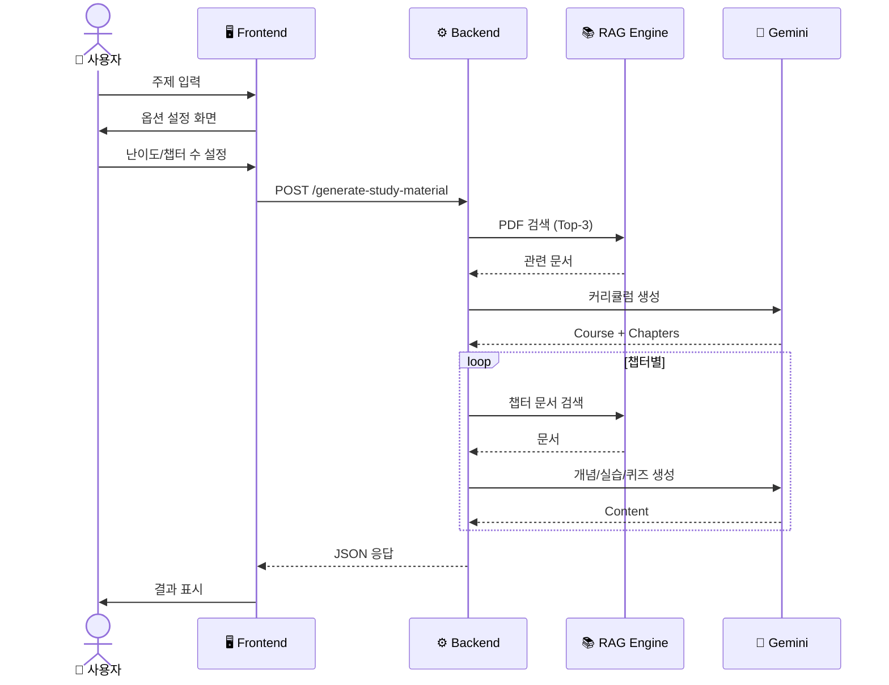

---

## 2. 세부 플로우

### 2.1 RAG 문서 검색

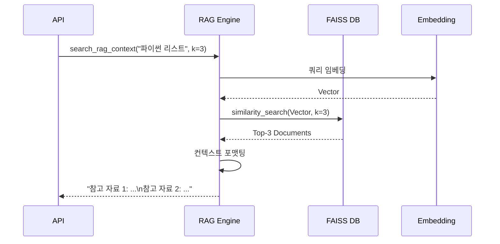

### 2.2 AI 콘텐츠 생성

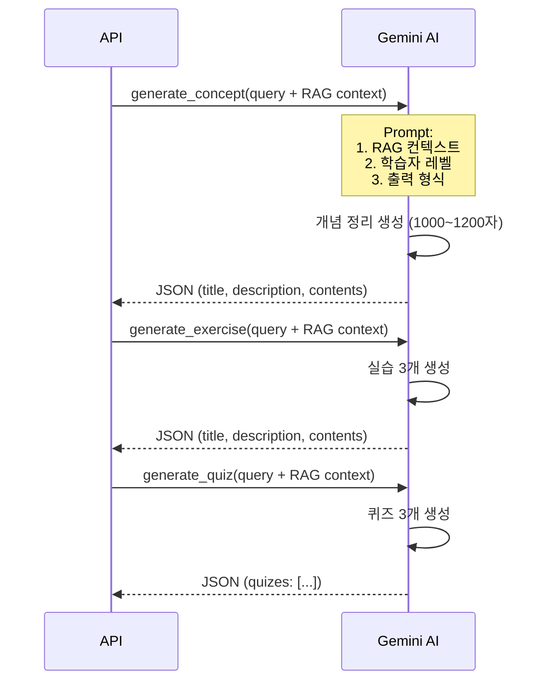

---

## 3. 사용자 시나리오별 플로우

### 3.1 빠른 학습 (수진의 사례)

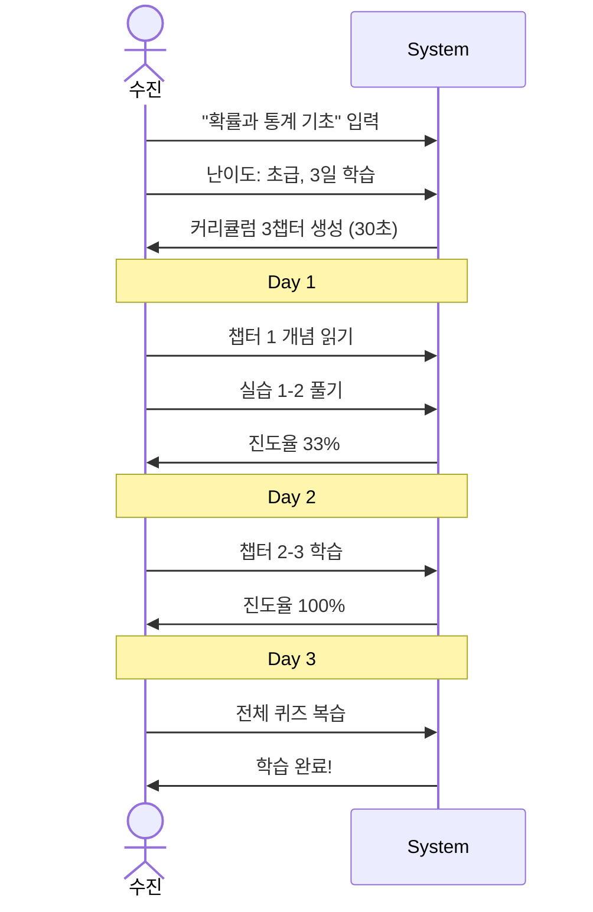

### 3.2 팀 학습 (민수의 사례)

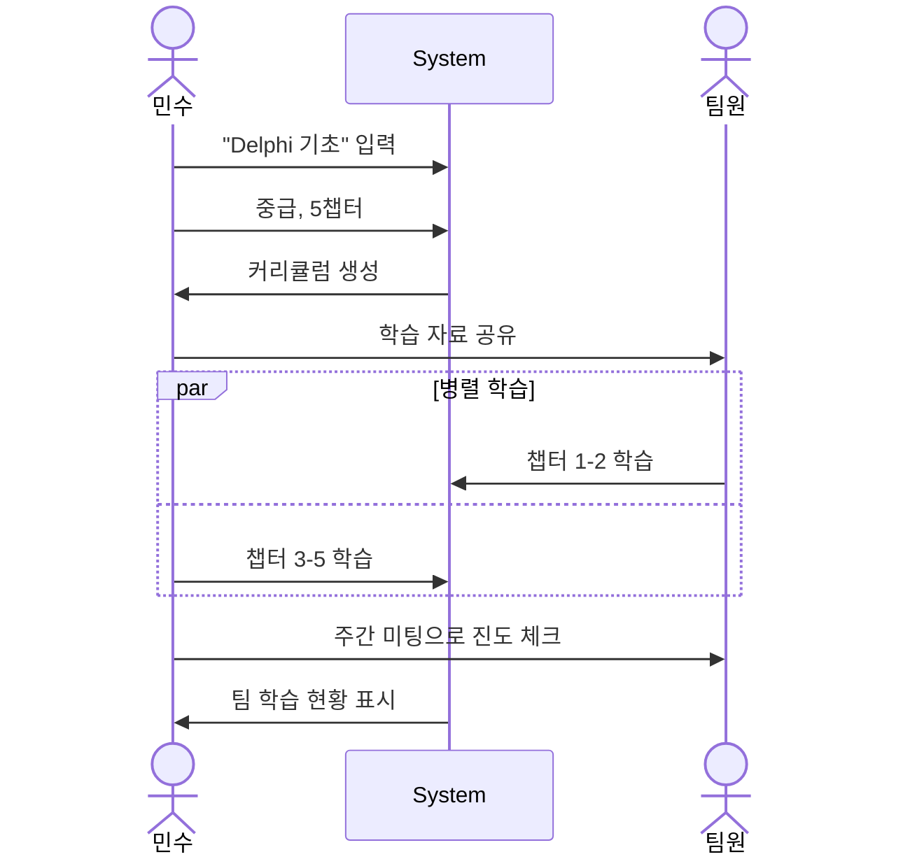

---

## 4. 에러 처리 플로우

### 4.1 생성 실패 처리

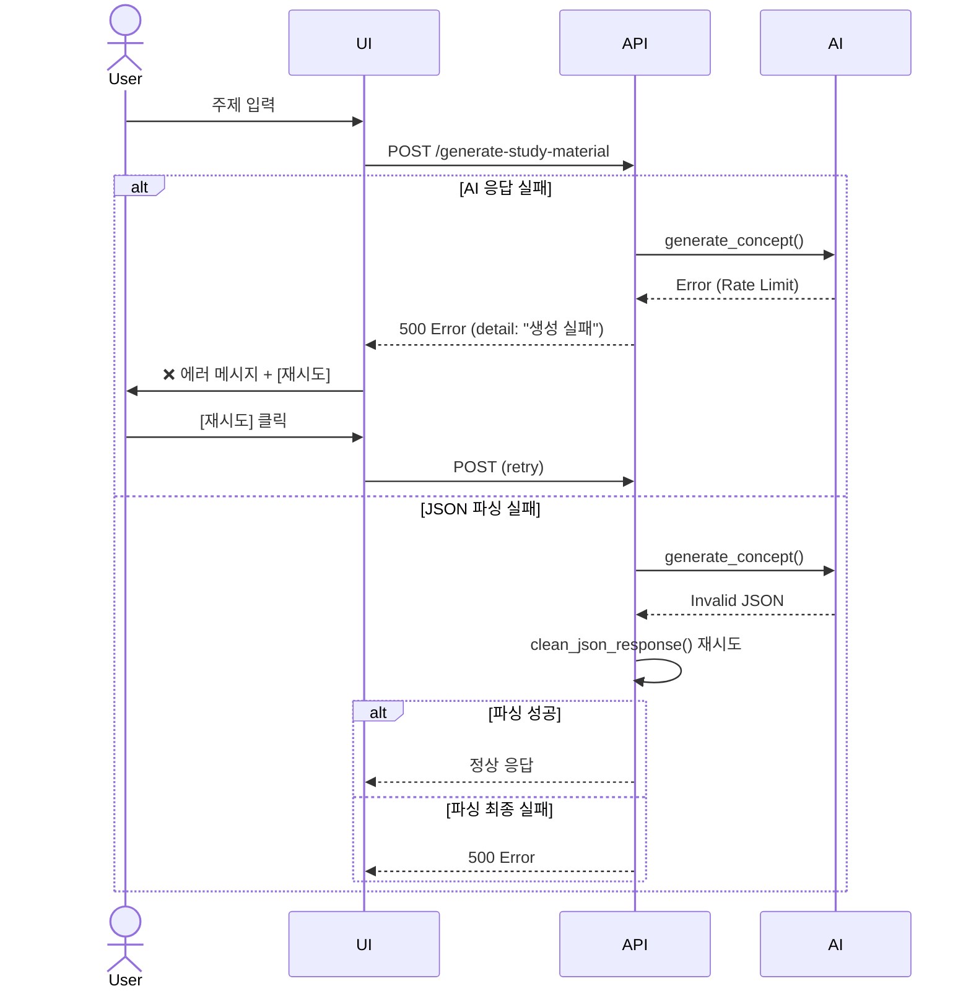

### 4.2 RAG 검색 실패 처리

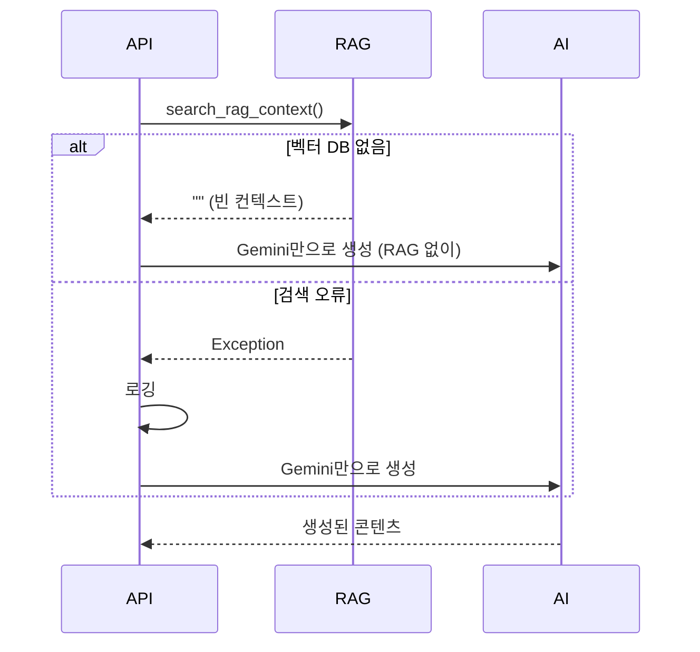

---

## 5. 데이터 플로우

### 5.1 PDF → 벡터 DB

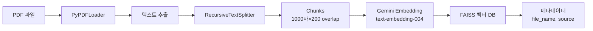

### 5.2 사용자 입력 → 학습 자료

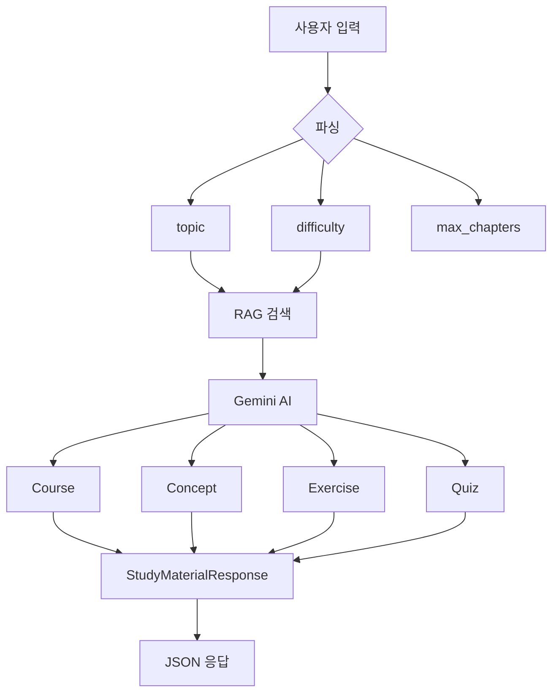

---

## 6. 상태 다이어그램

### 6.1 학습 진행 상태

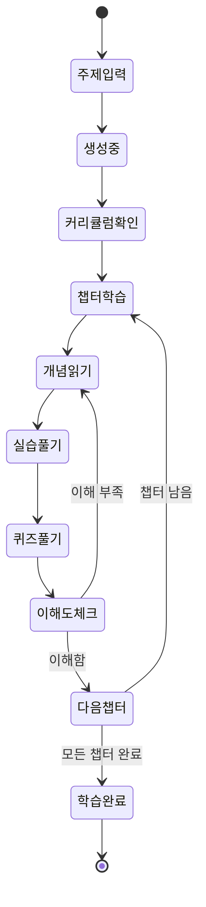

### 6.2 API 요청 상태

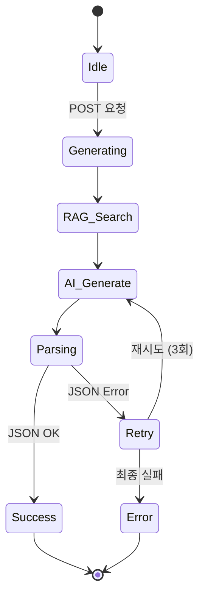

---

## 7. 시스템 컨텍스트

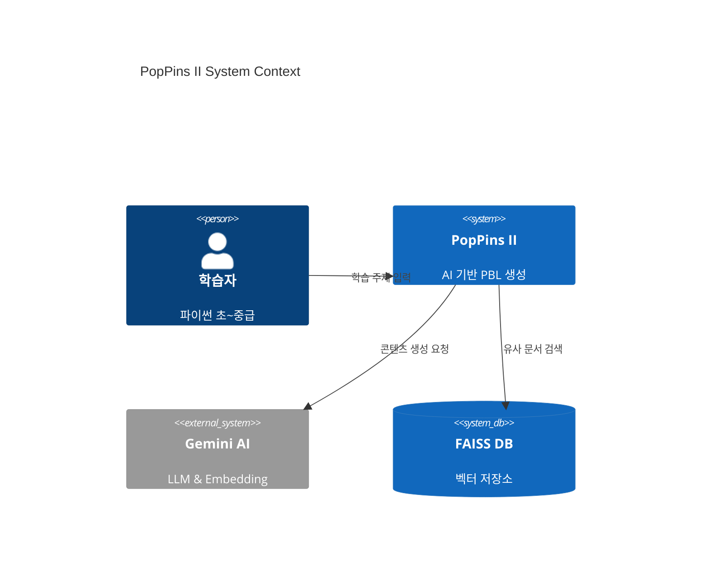

---

## 📚 참고 문서

- [통합 기획 문서](./pop_pins_ii_planning_document.md)
- [PRD](./pop_pins_ii_prd.md)
- [User Diagram](./pop_pins_ii_user_diagram.md)
- [Wireframe](./pop_pins_ii_wireframe.md)

---

**문서 버전**: 1.4.2  
**최종 수정일**: 2025-11-22  
**작성자**: 이진걸  
**상태**: 작성 완료
