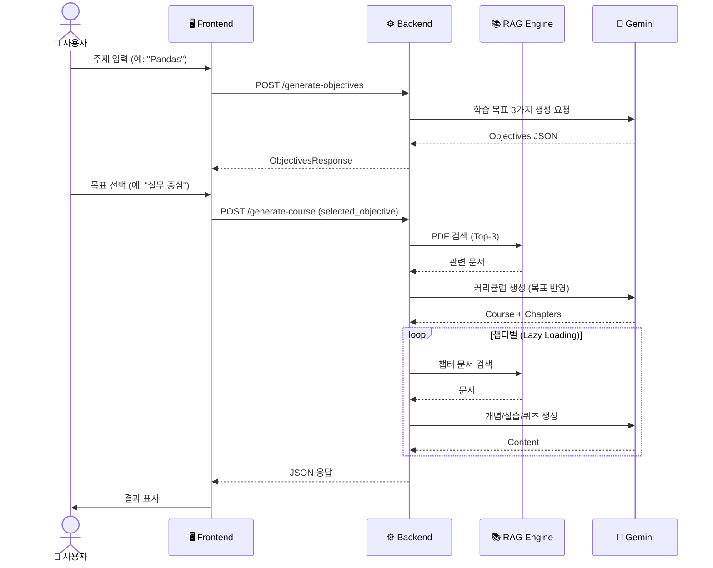
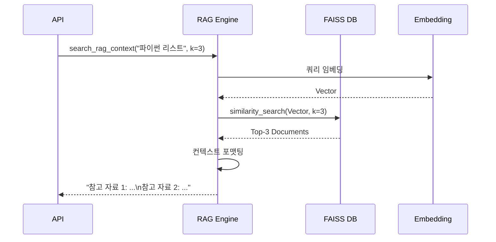
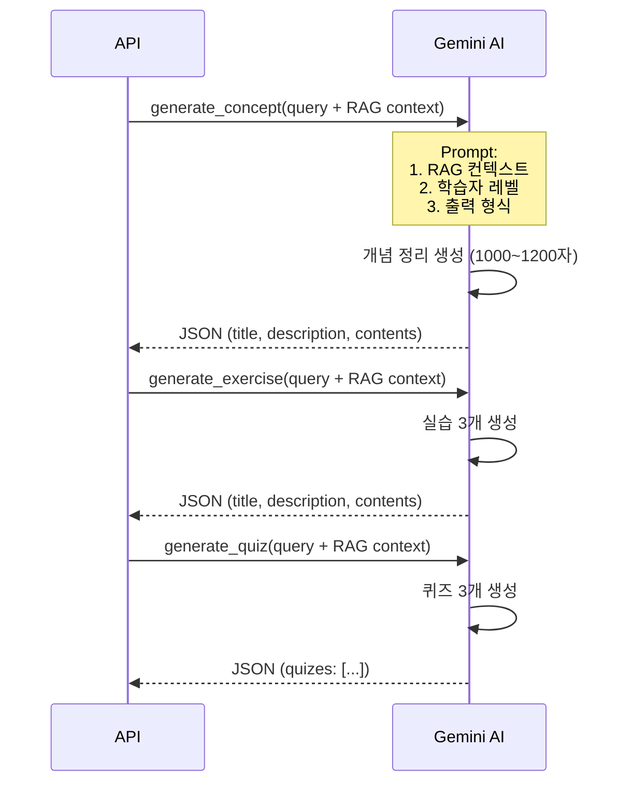
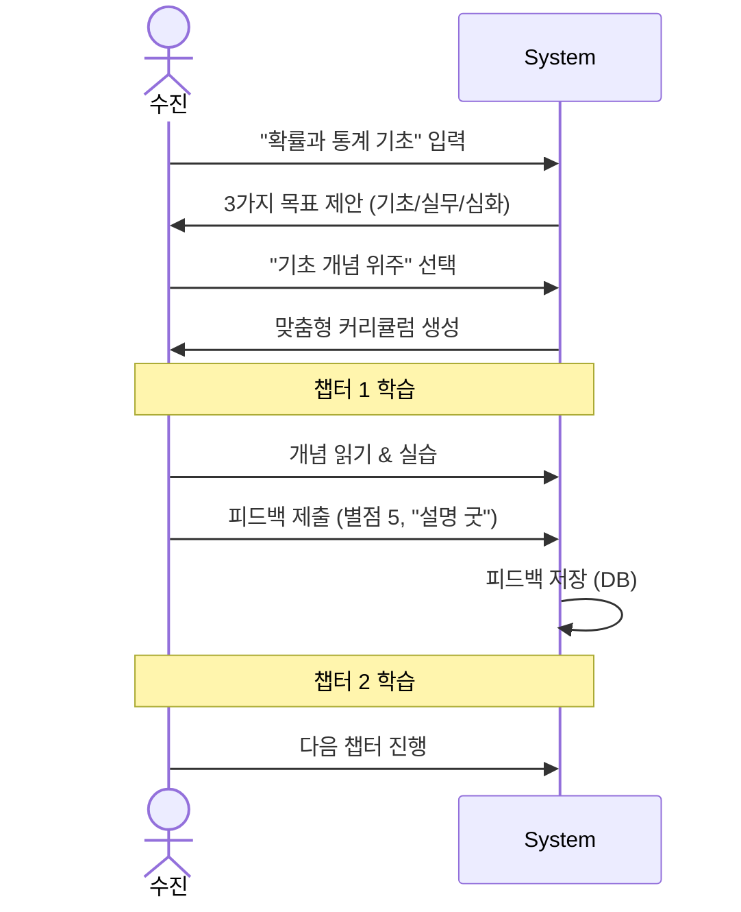
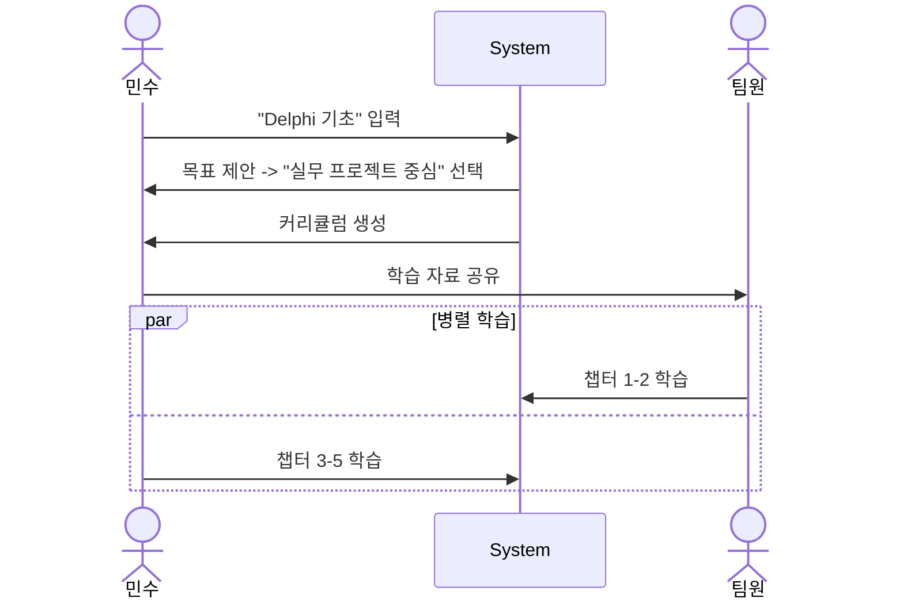
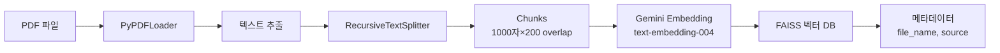
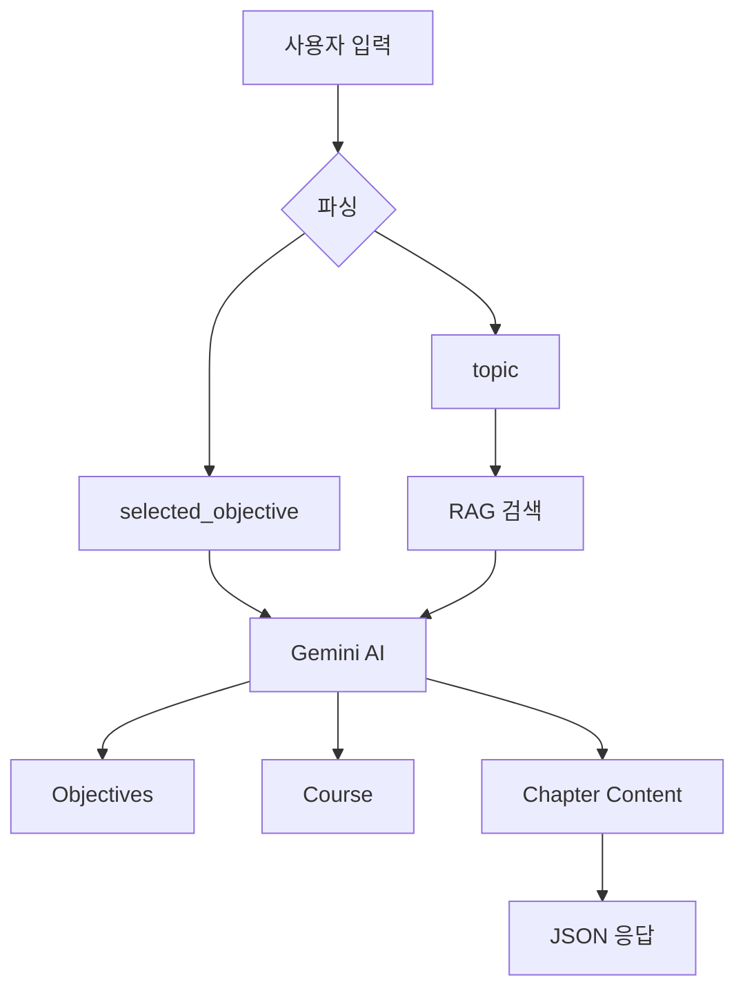
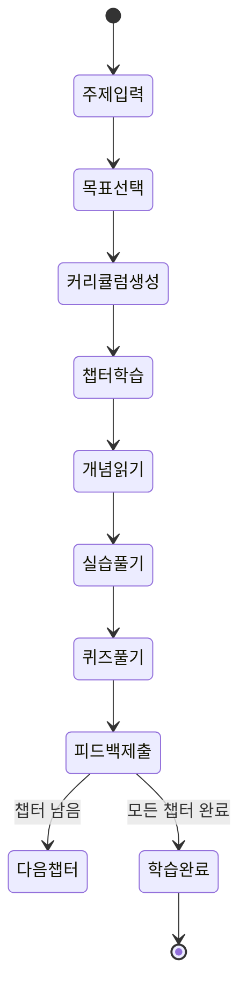
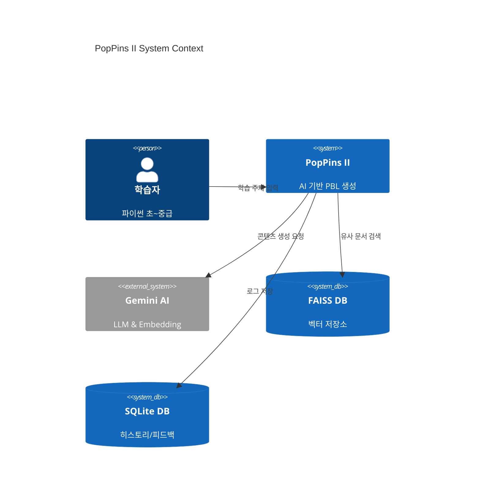

# PopPins II - Sequence Diagram

**프로젝트**: PopPins II  
**문서 타입**: System Sequence Diagrams  
**버전**: 1.9.0  
**작성일**: 2025-11-22  
**작성자**: 이진걸  
**최종 업데이트**: 2025-11-26

---

## 1. 전체 시스템 플로우

### 1.1 학습 자료 생성 플로우 (Adaptive Learning)



---

## 2. 세부 플로우

### 2.1 RAG 문서 검색



### 2.2 AI 콘텐츠 생성



---

## 3. 사용자 시나리오별 플로우

### 3.1 적응형 학습 (수진의 사례)



### 3.2 팀 학습 (민수의 사례)



---

## 4. 에러 처리 플로우

### 4.1 생성 실패 처리 (Retry Logic)

```mermaid
sequenceDiagram
    actor User
    participant UI
    participant API
    participant AI
    
    User->>UI: 주제 입력
    UI->>API: POST /generate-objectives
    
    loop Retry (Max 3 times)
        API->>AI: generate_content()
        alt AI 응답 실패 / JSON 에러
            AI-->>API: Exception
            API->>API: Wait 1s
        else 성공
            AI-->>API: Valid JSON
            break
        end
    end
    
    alt 최종 실패
        API-->>UI: 500 Error
        UI->>User: "일시적인 오류입니다. 다시 시도해주세요."
    else 성공
        API-->>UI: 정상 응답
    end
```

---

## 5. 데이터 플로우

### 5.1 PDF → 벡터 DB



### 5.2 사용자 입력 → 학습 자료



---

## 6. 상태 다이어그램

### 6.1 학습 진행 상태



---

## 7. 시스템 컨텍스트



---

## 📚 참고 문서

- [통합 기획 문서](./pop_pins_ii_planning_document.md)
- [PRD](./pop_pins_ii_prd.md)
- [User Diagram](./pop_pins_ii_user_diagram.md)
- [Wireframe](./pop_pins_ii_wireframe.md)

---

**문서 버전**: 1.5.0  
**최종 수정일**: 2025-11-25  
**작성자**: 이진걸  
**상태**: 작성 완료
