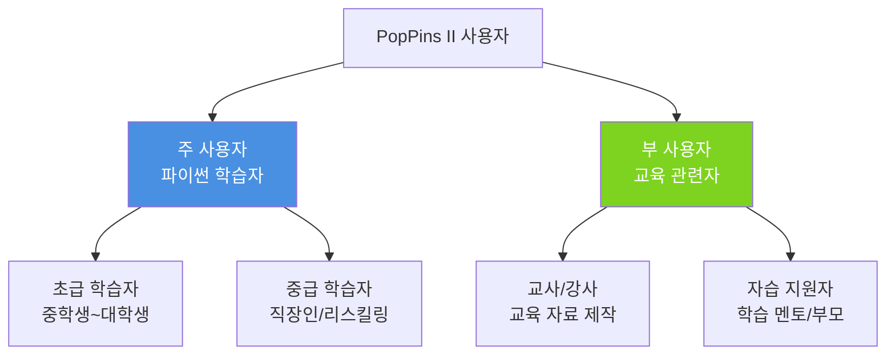
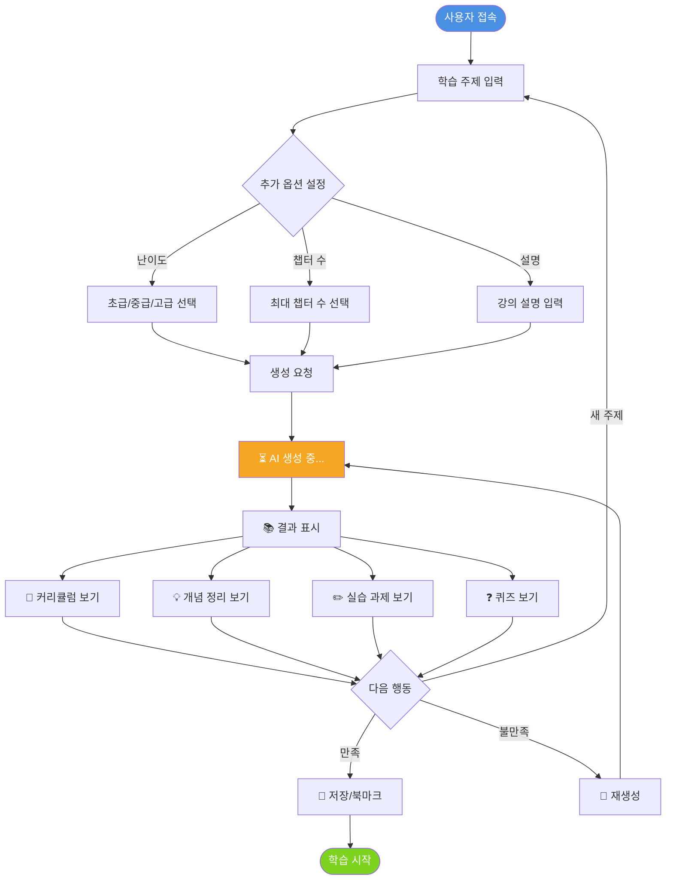
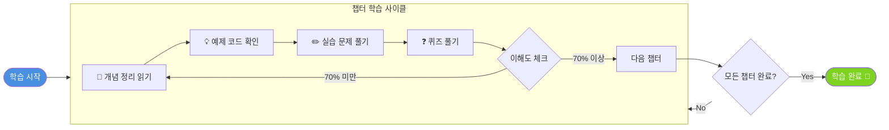
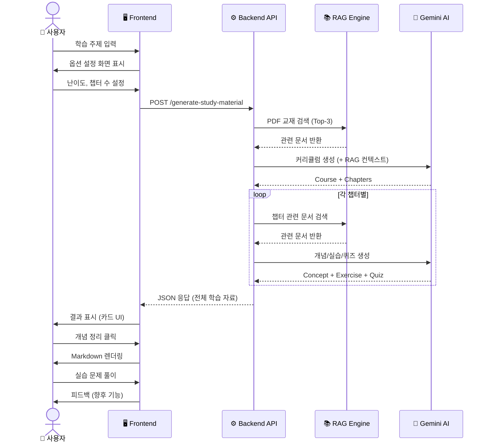
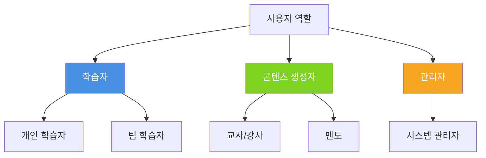
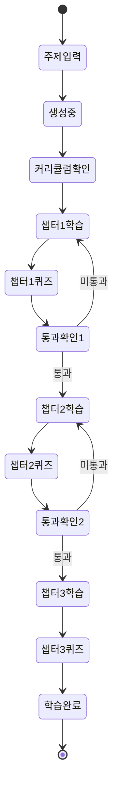
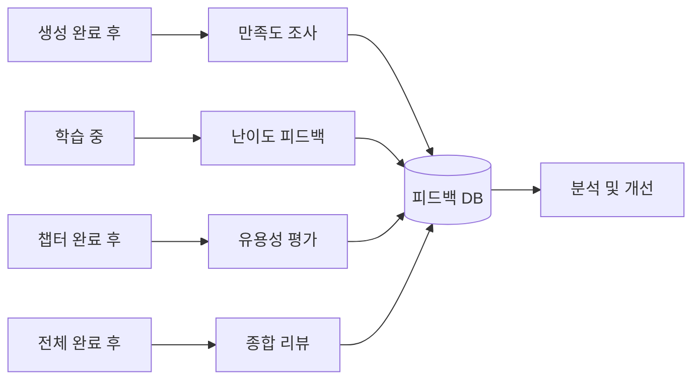
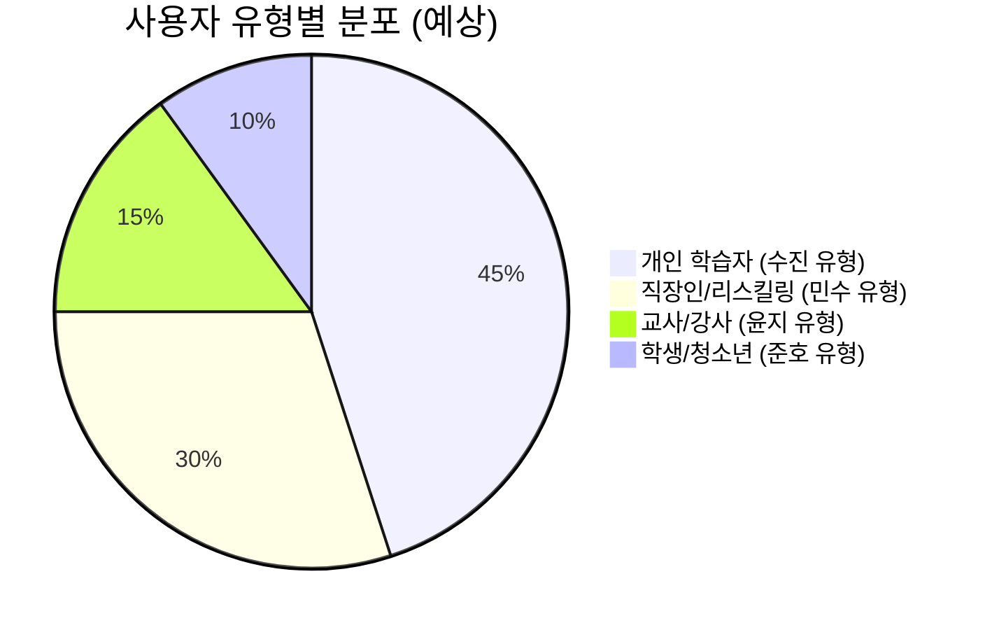
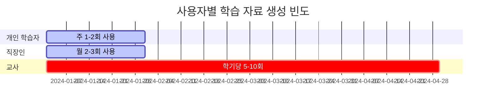

# PopPins II - User Diagram

**프로젝트**: PopPins II (어딧세이 가제)  
**문서 타입**: User Diagrams & Interaction Flow  
**버전**: 1.9.0  
**작성일**: 2025-11-22  
**최종 업데이트**: 2025-11-26

---

## 📋 목차

1. [사용자 페르소나 다이어그램](#1-사용자-페르소나-다이어그램)
2. [사용자 여정 맵 (User Journey Map)](#2-사용자-여정-맵-user-journey-map)
3. [사용자 상호작용 흐름도](#3-사용자-상호작용-흐름도)
4. [사용자 역할 및 권한](#4-사용자-역할-및-권한)

---

## 1. 사용자 페르소나 다이어그램

### 페르소나 분류



### 페르소나 1: 수진 (대학생, 23세) 🎓

```
┌─────────────────────────────────────────────┐
│           페르소나: 수진                     │
│  "짧은 시간, 필요한 내용을 학습"             │
├─────────────────────────────────────────────┤
│ 📊 Demographics                             │
│  - 나이: 23세                                │
│  - 직업: 대학생 (생명과학 전공)               │
│  - 교육: 대학교 3학년                         │
│                                              │
│ 🎯 Goals                                    │
│  - 중간고사 전 3일 내 확률/통계 복습          │
│  - AI 수업을 위한 기초 수학 개념 정리         │
│  - 비전공자도 이해할 수 있는 설명 필요        │
│                                              │
│ 😟 Pain Points                              │
│  - 시간 부족 (3일밖에 없음)                   │
│  - 비전공자라 기초 개념도 헷갈림              │
│  - 어디서부터 공부해야 할지 모름              │
│                                              │
│ 💡 Needs                                    │
│  - 핵심 개념만 빠르게 정리                    │
│  - 단계별 학습 가이드                         │
│  - 실습 문제로 이해도 체크                    │
│                                              │
│ 🖥️ Tech Savviness: ⭐⭐⭐⭐☆              │
│ 📱 Devices: 노트북, 스마트폰                 │
└─────────────────────────────────────────────┘
```

### 페르소나 2: 민수 (직장인, 31세) 💼

```
┌─────────────────────────────────────────────┐
│           페르소나: 민수                     │
│  "빠른 기간 안에 팀 단위 리스킬링"           │
├─────────────────────────────────────────────┤
│ 📊 Demographics                             │
│  - 나이: 31세                                │
│  - 직업: 소프트웨어 엔지니어                  │
│  - 팀: 5명 규모 개발팀                        │
│                                              │
│ 🎯 Goals                                    │
│  - Delphi 레거시 시스템 유지보수 학습         │
│  - 팀 전체 교육 자료 제작 (1개월 내)          │
│  - 실무 적용 가능한 예제 확보                 │
│                                              │
│ 😟 Pain Points                              │
│  - 팀 내 Delphi 경험자 없음                   │
│  - 기존 자료가 오래되고 산발적               │
│  - 시간 압박 (다음 달까지 교육 완료)         │
│                                              │
│ 💡 Needs                                    │
│  - 체계적인 커리큘럼                          │
│  - 팀원 각자 레벨에 맞는 학습 자료            │
│  - 실무 예제 및 프로젝트 기반 학습            │
│                                              │
│ 🖥️ Tech Savviness: ⭐⭐⭐⭐⭐              │
│ 📱 Devices: 업무용 노트북, 태블릿            │
└─────────────────────────────────────────────┘
```

### 페르소나 3: 윤지 (교사, 35세) 👩‍🏫

```
┌─────────────────────────────────────────────┐
│           페르소나: 윤지                     │
│  "공교육 내 실습형 AI 콘텐츠 설계"           │
├─────────────────────────────────────────────┤
│ 📊 Demographics                             │
│  - 나이: 35세                                │
│  - 직업: 중학교 도덕 교사                     │
│  - 추가 업무: 방과후 수업 담당               │
│                                              │
│ 🎯 Goals                                    │
│  - AI 윤리 교육 과정 개발 (1학기 분량)       │
│  - 한국어로 된 실습형 교육 자료 확보          │
│  - 학생들이 쉽게 따라할 수 있는 구조         │
│                                              │
│ 😟 Pain Points                              │
│  - 기존 AI 윤리 교재 부족                     │
│  - 대부분 영어 자료                           │
│  - 중학생 수준에 맞는 실습 자료 부재         │
│                                              │
│ 💡 Needs                                    │
│  - 한 학기 커리큘럼 (12~16주)                │
│  - 중학생 눈높이 설명                         │
│  - 실습 가능한 예제 및 활동                  │
│                                              │
│ 🖥️ Tech Savviness: ⭐⭐⭐☆☆              │
│ 📱 Devices: 학교 PC, 개인 노트북             │
└─────────────────────────────────────────────┘
```

### 페르소나 4: 준호 (중학생, 14세) 🎒

```
┌─────────────────────────────────────────────┐
│           페르소나: 준호                     │
│  "지역 교육 격차 극복"                       │
├─────────────────────────────────────────────┤
│ 📊 Demographics                             │
│  - 나이: 14세                                │
│  - 학교: 중학교 2학년                         │
│  - 거주지: 강릉 인근 농어촌 마을              │
│                                              │
│ 🎯 Goals                                    │
│  - 코딩 배우고 싶음 (파이썬)                  │
│  - 혼자서도 학습 가능한 자료 필요             │
│  - 온라인으로 체계적인 공부                   │
│                                              │
│ 😟 Pain Points                              │
│  - 학교에 코딩 수업/동아리 없음               │
│  - 집에서 학교까지 버스 40분                  │
│  - 유튜브만으로는 체계적 학습 어려움         │
│                                              │
│ 💡 Needs                                    │
│  - 단계별 가이드                              │
│  - 혼자서도 이해 가능한 설명                  │
│  - 즉시 피드백 받을 수 있는 퀴즈             │
│                                              │
│ 🖥️ Tech Savviness: ⭐⭐⭐☆☆              │
│ 📱 Devices: 가족 공용 PC, 스마트폰           │
└─────────────────────────────────────────────┘
```

---

## 2. 사용자 여정 맵 (User Journey Map)

### 여정 1: 수진의 학습 여정 (3일 집중 학습)

```mermaid
journey
    title 수진의 확률/통계 복습 여정 (3일)
    section Day 1: 인지
        중간고사 3일 전 깨달음: 1: 수진
        PopPins II 발견: 3: 수진
        "확률과 통계 기초" 입력: 4: 수진
        난이도 "초급" 선택: 4: 수진
    section Day 1: 학습 시작
        커리큘럼 확인 (3챕터): 5: 수진
        챕터1 개념 정리 읽기: 4: 수진
        실습 문제 풀기: 3: 수진
        막히는 부분 발생: 2: 수진
    section Day 2: 집중 학습
        챕터1 퀴즈로 복습: 4: 수진
        챕터2 개념 학습: 5: 수진
        실습 문제로 응용: 4: 수진
        챕터3 빠르게 훑기: 4: 수진
    section Day 3: 마무리
        전체 복습 (개념 요약): 5: 수진
        어려운 퀴즈 다시 풀기: 4: 수진
        중간고사 준비 완료: 5: 수진
        만족도: 5: 수진
```

### 여정 2: 민수의 팀 학습 자료 제작 여정

```mermaid
journey
    title 민수의 Delphi 팀 교육 자료 제작 여정 (1개월)
    section Week 1: 탐색
        레거시 업무 배정 받음: 1: 민수
        Delphi 자료 검색: 2: 민수
        PopPins II 발견: 4: 민수
        "Delphi 기초" 입력: 5: 민수
    section Week 2: 자료 생성
        초급~중급 커리큘럼 생성: 5: 민수
        팀원들과 공유: 5: 민수
        피드백 수렴: 4: 민수
        일부 챕터 재생성: 4: 민수
    section Week 3: 학습 진행
        팀원 개별 학습 시작: 4: 민수
        주간 미팅으로 진도 체크: 4: 민수
        실습 문제 같이 풀기: 5: 민수
    section Week 4: 완료
        팀 전체 학습 완료: 5: 민수
        레거시 코드 분석 시작: 5: 민수
        교육 자료 아카이빙: 5: 민수
        만족도: 5: 민수
```

---

## 3. 사용자 상호작용 흐름도

### 3.1 기본 사용자 플로우



### 3.2 상세 상호작용 플로우 (챕터별 학습)



### 3.3 사용자-시스템 상호작용



---

## 4. 사용자 역할 및 권한

### 4.1 사용자 역할 분류



### 4.2 권한 매트릭스

| 기능               | 개인 학습자  | 팀 학습자 | 교사/강사     | 관리자   |
| ------------------ | ------------ | --------- | ------------- | -------- |
| 학습 자료 생성     | ✅            | ✅         | ✅             | ✅        |
| 학습 자료 조회     | ✅ (본인)     | ✅ (팀)    | ✅ (전체)      | ✅ (전체) |
| 학습 자료 수정     | ❌ (재생성만) | ❌         | ✅             | ✅        |
| 학습 자료 삭제     | ❌            | ❌         | ✅             | ✅        |
| 학습 히스토리 조회 | ✅ (본인)     | ✅ (본인)  | ✅ (소속 학생) | ✅ (전체) |
| 난이도 설정        | ✅            | ✅         | ✅             | ✅        |
| 커리큘럼 공유      | ❌            | ✅         | ✅             | ✅        |
| 시스템 설정        | ❌            | ❌         | ❌             | ✅        |

---

## 5. 사용자 인터랙션 패턴

### 5.1 학습 자료 생성 패턴

```
1️⃣ 빠른 생성 (Quick Generate)
   사용자: "파이썬 리스트" 입력 → 생성
   시스템: 기본 설정(중급, 3챕터)으로 즉시 생성
   
2️⃣ 상세 설정 (Custom Generate)
   사용자: 주제 + 난이도 + 챕터 수 + 설명 입력
   시스템: 맞춤형 커리큘럼 생성
   
3️⃣ 대화형 생성 (향후 기능)
   사용자: "람다 함수 배우고 싶어요"
   AI: "사전 지식이 있나요? (함수, 클로저 등)"
   사용자: "함수는 알아요"
   AI: "그럼 3챕터로 구성할게요: 기초→응용→실전"
```

### 5.2 학습 진행 패턴



---

## 6. 사용자 피드백 채널

### 6.1 피드백 수집 시점



### 6.2 피드백 유형

| 유형        | 수집 방법             | 활용 목적        |
| ----------- | --------------------- | ---------------- |
| 만족도      | ⭐⭐⭐⭐⭐ (5점 척도)      | 전반적 품질 평가 |
| 난이도      | 너무 쉬움/적절/어려움 | 난이도 조정      |
| 유용성      | 실습 문제 도움 여부   | 콘텐츠 개선      |
| 버그 리포트 | 오류 발견 시 제출     | 시스템 안정성    |

---

## 7. 사용자 행동 분석

### 7.1 예상 사용 패턴



### 7.2 학습 자료 생성 빈도 (예상)



---

## 8. 접근성 (Accessibility)

### 8.1 다양한 사용자 지원

| 사용자 그룹   | 지원 방안               |
| ------------- | ----------------------- |
| 시각 장애인   | 스크린 리더 호환 (향후) |
| 색맹 사용자   | 색상 대비 고려          |
| 저속 인터넷   | 최소 데이터 전송        |
| 모바일 사용자 | 반응형 디자인 (향후)    |

---

## 📚 참고 문서

- [통합 기획 문서](./pop_pins_ii_planning_document.md)
- [PRD](./pop_pins_ii_prd.md)
- [원본 PWD](./PWD_어딧세이.md)

---

**문서 버전**: 1.4.2  
**최종 수정일**: 2025-11-22  
**작성자**: 이진걸  
**상태**: 작성 완료
