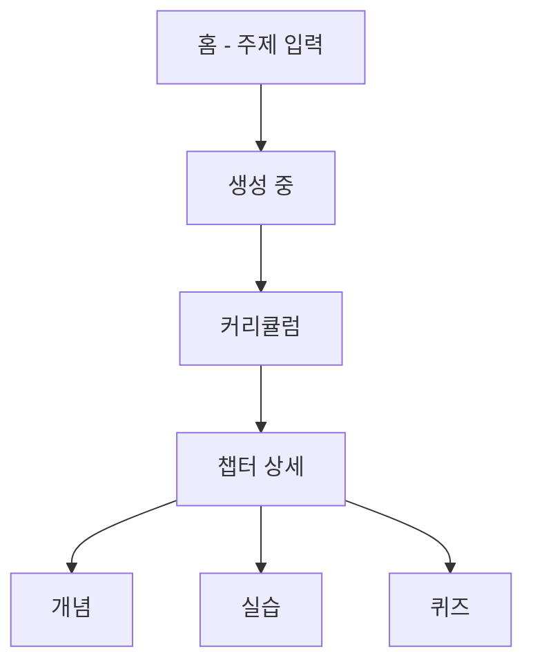

# PopPins II - Wireframe

**프로젝트**: PopPins II  
**문서 타입**: UI/UX Wireframes  
**버전**: 1.4.2  
**작성일**: 2025-11-22  
**최종 업데이트**: 2025-11-22

---

## 1. 화면 구조 개요

### 1.1 화면 맵



### 1.2 주요 화면

| 화면 | MVP | 우선순위 |
|------|-----|---------|
| 홈 (주제 입력) | ✅ | P0 |
| 생성 중 | ✅ | P0 |
| 커리큘럼 | ✅ | P0 |
| 챕터 상세 | ✅ | P1 |
| 개념/실습/퀴즈 뷰어 | ✅ | P1 |
| 히스토리 | ❌ | P2 |

---

## 2. 주요 와이어프레임

### 2.1 홈 화면

```
┌─────────────────────────────────────┐
│  🎓 PopPins II      [프로필] [설정]  │
├─────────────────────────────────────┤
│   🌟 AI와 함께 설계하는 나만의 배움   │
│                                     │
│  📝 무엇을 배우고 싶나요?            │
│  ┌───────────────────────────────┐  │
│  │ 예: 파이썬 리스트, Flask...   │  │
│  └───────────────────────────────┘  │
│                                     │
│  난이도: ( ) 초급 (●) 중급 ( ) 고급 │
│  챕터 수: [  3  ]                   │
│                                     │
│      [ 🚀 학습 자료 생성하기 ]       │
│                                     │
│  📚 최근 학습                        │
│  [파이썬 리스트] [Flask 기초]        │
└─────────────────────────────────────┘
```

### 2.2 생성 중 화면

```
┌─────────────────────────────────────┐
│  ⏳ "파이썬 리스트" 생성 중...        │
│                                     │
│  ████████████░░░░░░  65%            │
│                                     │
│  ✅ 커리큘럼 생성 완료               │
│  🔄 챕터 1 실습 생성 중...          │
│  ⏸️  챕터 2 대기 중                 │
│                                     │
│  ⏱️  약 30초 남음                    │
└─────────────────────────────────────┘
```

### 2.3 커리큘럼 화면

```
┌─────────────────────────────────────┐
│  ◀ 뒤로                              │
│  📚 파이썬 리스트    [🔄] [💾]       │
│                                     │
│  ┌───────────────────────────────┐  │
│  │ 📖 챕터 1: 리스트 기초        │  │
│  │ 리스트 생성과 기본 연산       │  │
│  │ 💡 개념  ✏️ 실습 3  ❓ 퀴즈 3│  │
│  │   [ 학습 시작 → ]             │  │
│  └───────────────────────────────┘  │
│                                     │
│  ┌───────────────────────────────┐  │
│  │ 📖 챕터 2: 리스트 메서드      │  │
│  │ append, extend, insert 등     │  │
│  │ 💡 개념  ✏️ 실습 3  ❓ 퀴즈 3│  │
│  │   [ 학습 시작 → ]             │  │
│  └───────────────────────────────┘  │
└─────────────────────────────────────┘
```

### 2.4 챕터 상세 화면

```
┌─────────────────────────────────────┐
│  ◀ 커리큘럼                          │
│  📖 챕터 1: 리스트 기초              │
│  ████████░░░░  40%                  │
│                                     │
│  [💡 개념] [✏️ 실습] [❓ 퀴즈]      │
│                                     │
│  ┌───────────────────────────────┐  │
│  │ # 리스트란?                   │  │
│  │                               │  │
│  │ 파이썬 리스트는 순서가 있는    │  │
│  │ 변경 가능한 컬렉션입니다...    │  │
│  │                               │  │
│  │ ```python                     │  │
│  │ my_list = [1, 2, 3]           │  │
│  │ ```                           │  │
│  │                               │  │
│  │ 📚 참고: python_basics.pdf    │  │
│  └───────────────────────────────┘  │
│                                     │
│  ◀ 이전           다음: 실습 ▶      │
└─────────────────────────────────────┘
```

---

## 3. 컴포넌트

### 3.1 공통

- **Header**: 로고 + 사용자 메뉴
- **Card**: 제목 + 내용 + 액션
- **ProgressBar**: 진행률 표시
- **Button**: Primary/Secondary

### 3.2 페이지별

- **TopicForm**: 주제 입력 + 옵션
- **CourseList**: 챕터 카드 리스트
- **MarkdownViewer**: 개념 정리 렌더링
- **ExerciseViewer**: 실습 문제 표시
- **QuizViewer**: 퀴즈 표시

---

## 4. 반응형

| 디바이스 | 너비 | 레이아웃 |
|---------|------|---------|
| Mobile | 320px+ | 1 column |
| Tablet | 768px+ | 1-2 column |
| Desktop | 1024px+ | 2-3 column |

---

## 5. 색상 & 타이포그래피

### 색상
- Primary: #4A90E2 (파란색)
- Success: #7ED321 (초록색)
- Warning: #F5A623 (주황색)

### 폰트
- 본문: Inter 16px
- 제목: Inter 24px Bold
- 코드: Fira Code 14px

---

**문서 버전**: 1.4.2  
**최종 수정일**: 2025-11-22  
**상태**: 디자인 명세 완료
